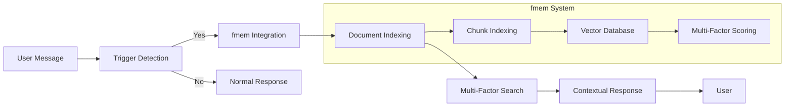
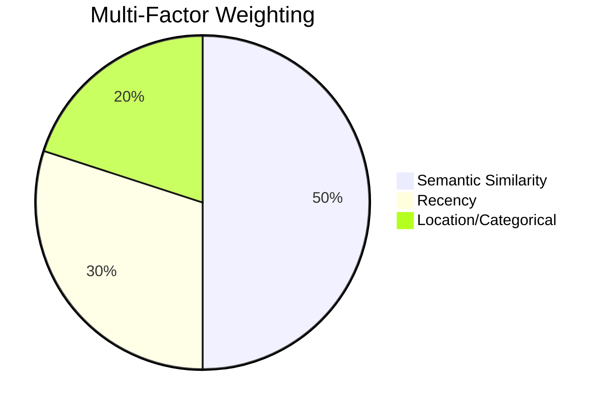
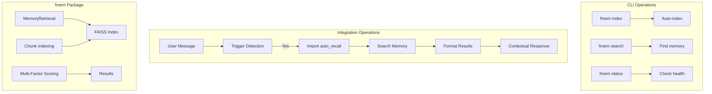

# fmem 🧠

**Contextual Memory for Natural Conversations**

Version: 3.2.0  
Status: Production Ready ✅  
License: MIT

**Latest:** Hybrid chunking with table-aware splitting (v3.2.0, Feb 2026)

---

## What is fmem vs OpenClaw?

**🤖 OpenClaw** is the AI assistant framework that manages conversations, implements agent logic, and provides the interface for interacting with you.

**🧠 fmem** is a specialized memory system that OpenClaw uses to recall your previous conversations and context. It's like OpenClaw's "memory brain".

### Relationship
```
You ↔ OpenClaw (AI Assistant) ↔ fmem (Memory System)
```

**OpenClaw does:**
- Manages conversations and agent behavior
- Makes decisions about when to use memory
- Generates responses based on retrieved context
- Provides CLI interface for standalone operations

**fmem does:**
- Stores and indexes your memory files (documents, notes, etc.)
- Performs semantic search across your content
- Provides auto_recall functionality for OpenClaw integration
- Maintains FAISS indexes for fast similarity search

---

## Overview

fmem is a privacy-first memory system that makes AI conversations feel natural and continuous. It remembers the precise context you need — not entire documents, not isolated keywords, but the *meaningful chunks* that matter.

> 🧠 **Memory that understands structure, not just text.**

**Core Innovation:** Chunk-level semantic indexing splits documents by structure (`##` headings) rather than arbitrary token boundaries. This delivers:
- **Precise retrieval** — Gets the relevant section, not the whole file
- **~57% token reduction** — Less noise, more signal in context windows
- **Natural conversation flow** — References that feel contextual, not robotic

**v3.2.0 Update: Hybrid Chunking**

New table-aware chunking eliminates LLM-based workarounds:
- **Tables treated as atomic units** — No more mid-row splits
- **Zero LLM calls** — Pure Python regex parsing
- **20x faster indexing** — 1-2s vs 30s+ for table-heavy files
- **Inspired by** [md2chunks](https://github.com/verloop/md2chunks), [advanced-chunking](https://github.com/joshuamckenty/advanced-chunking), [semantic-chunker](https://github.com/dorian-brown/semantic-chunker)

See [docs/CHUNKING_STRATEGY.md](./docs/CHUNKING_STRATEGY.md) for full details.

**How It Works:**



**Multi-Factor Ranking:** Beyond simple similarity, fmem scores results by:
- **Semantic (50%):** FAISS vector similarity
- **Recency (30%):** Time-based decay based on file modification time  
- **Location/Categorical (20%):** Directory importance (docs: 1.5×, projects: 1.3×, chats: 0.8×)



**See Examples:** For detailed workflows and real-world usage, see [docs/EXAMPLES.md](./docs/EXAMPLES.md)

---

## Project Structure

```
projects/fmem/
├── src/                    # Core source code
├── docs/                   # Documentation
├── tests/                  # Test suite
├── examples/               # Usage examples
├── config/                 # Configuration templates
├── mcp-wrapper/           # MCP server implementation (future)
└── README.md              # This file
```

---

## Current Implementation

**Repository:** `github.com/LuisEduardoAvila/fmem`

### Architecture



### Components

| Component | Purpose | Location | Usage |
|-----------|---------|----------|-------|
| `MemoryRetrieval` | Core search class | `src/fmem/fmem.py` | Both CLI & OpenClaw Integration |
| `auto_recall()` | OpenClaw integration function | `src/fmem/fmem_integration.py` | Called by OpenClaw: `from fmem import auto_recall` |
| `cli.py` | Command-line interface | `src/fmem/cli.py` | Standalone CLI: `fmem index`, `fmem search` |
| `ConfigManager` | Configuration handling | `src/fmem/fmem.py` | Used by both CLI and OpenClaw |

---

## 🏗️ How fmem Works (Architecture)

### Current Implementation: AGENTS.md Integration

**The flow is:**

```
You → Message → OpenClaw → should_search() check → fmem Integration
                                                      ↓
                                            True: auto_recall() called
                                                      ↓
                                            Results added to OpenClaw context
                                                      ↓
                                            OpenClaw responds with memory
```

**Key Characteristic:** **OpenClaw decides when to search.** Your message triggers the check, but OpenClaw actively calls fmem only when patterns match.

### Future: Automatic Hook - Planned

**Different approach:** OpenClaw would search **before** processing your message:

```
You → Message → OpenClaw Auto-Searches fmem → Injects results
                                              ↓
                              OpenClaw receives message + context
                                              ↓
                              OpenClaw responds with "just knowing"
```

**Key Difference:** **Automatic injection.** Every message gets searched, results injected if relevant. OpenClaw doesn't decide—it's automatic.

### Comparison

| Aspect | Current | Future Planned |
|--------|--------|----------------|
| **Who searches?** | OpenClaw searches after seeing message | OpenClaw searches before seeing message |
| **When does memory appear?** | After OpenClaw decides to call fmem | Before OpenClaw processes message |
| **Does OpenClaw "just know"?** | ❌ No, actively retrieves | ✅ Yes, it's in context |
| **Misses context?** | Possible if no trigger | Catches everything |
| **Speed** | Fast | Slightly slower |
| **Implementation** | ✅ Live now | 📋 Planned |

**Bottom Line:** Current implementation requires OpenClaw to **actively retrieve** when triggers match. Future would make memory **automatically present** in every conversation.

---

## 📝 Key Triggers

**Automatic recall activates on:**

| Type | Examples |
|------|----------|
| **Explicit** | "remember", "recall", "what about" |
| **Context** | "fitness", "movies", "projects", "work" |
| **Time** | "last week", "previous", "recently", "before" |
| **Personal** | "my goals", "my preferences", "my schedule", "we discussed" |

### 🔧 Integration Setup

**Required: Add this to AGENTS.md**

```markdown
## Memory Recall with fmem

When the user mentions any of these triggers, OpenClaw automatically recalls relevant information from fmem:

### Trigger Patterns (check with should_search())
- "remember", "recall", "what about", "last week", "previous", "before"
- "my projects", "my goals", "we discussed", "you mentioned"
- "fitness", "movies", "work", "travel" (personal context topics)

### Automatic Recall Procedure
When triggers detected:
1. OpenClaw imports: `from fmem import auto_recall, format_results`
2. OpenClaw calls: `results = auto_recall(user_message, top_k=3, chunk_mode='chunk')`
3. OpenClaw formats: `context = format_results(results, max_preview=150)`
4. OpenClaw injects: Add context to your response naturally

### Important Notes
- fmem is LOCAL (privacy-safe, no external APIs)
- Check deduplication (don't recall same file within 5 minutes)
- Respect token limits (keep context under 500 tokens)
- Never mention technical details (<retrieved_memory> tags, scores)
- Present information naturally: "Earlier you mentioned..."
```

**Note:** This content needs to be added to your AGENTS.md file for full integration.

## 📝 Content Structure Guidelines for fmem

For optimal fmem search performance across all indexed content, structure your files with ## headings:

### Good Structure Examples

**Memory Files (`memory/`):**
```markdown
## Work Updates
I worked on fmem documentation today. The indexing process is really interesting...

## System Fixes  
I fixed the cron job to run silently every 3 hours. The incremental updates work well.

## User Questions
The user asked great questions about compatibility and headings.
```

**Notes (`notes/`):**
```markdown
## Project Documentation
fmem documentation improvements completed...

## System Architecture  
Cron job integration working well...

## Research Findings  
Memory search vs fmem analysis complete...
```

**Decisions (`decisions/`):**
```markdown
## Technical Decisions
- Switched to 3-hour cron schedule
- Added rate limiting for Ollama API

## Project Roadmap  
- Phase 1: Core stability ✅
- Phase 2: Enhanced features 🔄

## Budget Decisions
- Approved fmem development time
- Resources allocated for testing...
```

**Project READMEs (`projects/*/README.md`):**
```markdown
## Overview
fmem provides contextual memory for AI conversations...

## Installation
Setup with pip install and configuration...

## Usage Examples
Command-line usage and integration examples...

## Development Roadmap
Current status and future plans...
```

### Why This Matters
- **Better chunking**: Each ## heading becomes a separate chunk for semantic search
- **More targeted results**: Search queries return relevant sections, not entire files
- **Improved accuracy**: Semantic search works better with smaller, focused chunks
- **Better performance**: Less content to embed = faster indexing

### When to Add Headings
- **Daily files**: Add ## sections for different topics/projects
- **Notes**: Structure by project or subject area
- **Decisions**: Separate by decision type or timeframe
- **Projects**: Use ## for different phases or features
- **Documentation**: Organize by sections (Overview, Installation, Usage, etc.)

### Applies To All fmem-Indexed Content:
- ✅ `memory/` - Daily memory logs
- ✅ `notes/` - Documentation and research notes
- ✅ `decisions/` - Project and technical decisions
- ✅ `docs/` - Architectural documentation
- ✅ `projects/*/README.md` - Project README files
- ✅ Any custom directories in `additional_dirs`

**Note**: Files without ## headings will be treated as single chunks, reducing search effectiveness across all fmem-indexed content.

---

## Chunking Strategy

**fmem v3.1.0+** uses fixed-size chunking based on the embedding model's token limits.

### The Constraint

Uses `all-minilm:22m` which has:
- **Context length:** 512 tokens
- **Embedding length:** 384 dimensions

In practice: **~800 characters** fits safely within 512 tokens.

Hardware RAM doesn't constrain chunking - the embedding model does.

### Smart Boundary Detection

Large sections are intelligently split at optimal boundaries:

1. **Section boundaries** (`##` headings) - highest priority
2. **Paragraph boundaries** (blank lines) - maintain flow
3. **Sentence boundaries** (periods) - preserve meaning
4. **Word boundaries** (spaces) - fallback option

Each split includes **overlap** (100 characters) to preserve semantic continuity between chunks.

### Fixed Chunk Size

| Setting | Value | Reason |
|---------|-------|--------|
| Chunk size | **800 chars** | Fits in 512 token limit |
| Overlap | **100 chars** | Semantic continuity |
| Preprocessing | **~500 chars** | Headings + summary for embedding |

### Content Preservation

Full chunk content is stored in FAISS index. Before embedding, content is preprocessed to ~500 characters (headings + summary) to optimize search quality.

```python
# Full chunk stored for retrieval
chunk.content  # Full text (up to 800 chars)

# Preprocessed for embedding
processed = headings + summary  # ~500 chars
embedding = model.encode(processed)  # Fits in 512 tokens
```

**Search queries the full semantic representation while respecting model limits.**

---

## Multi-Factor Ranking

**Formula:**
```
Score = (Semantic × 0.5) + (Recency × 0.3) + (Location × 0.2)
```

- **Semantic (50%):** FAISS vector similarity
- **Recency (30%):** Exponential decay based on file modification time
- **Location (20%):** Directory importance (docs: 1.5x, projects: 1.3x, chats: 0.8x)

---

## Integration Options

fmem supports three integration approaches:

### Option 1: AGENTS.md Integration ✅ CURRENT (Recommended)

**Status:** ✅ Implemented and Active

**How it works:**
- Agent reads AGENTS.md at session start
- Detects trigger words in user messages ("remember", "what about", etc.)
- Automatically recalls relevant context
- Injects naturally into conversation

**Example:**
```
User: "What were my fitness goals?"
Agent: (detects triggers → auto_recall() → responds with context)
```

**Pros:**
- ✅ Working immediately
- ✅ No code changes needed
- ✅ Agent decides when to recall
- ✅ Natural conversation flow

**Location:** See `AGENTS.md` - Memory Recall section

---

### Option B: Automatic Hook 🔄 PLANNED

**Status:** 🔄 Planned for Phase 2B

**How it will work:**
- Automatic `should_search()` on EVERY message
- Silent recall (injects context without mentioning)
- Token budget management
- Score threshold filtering

**Decision:** Evaluate after 2 weeks of Option 1 usage

---

### Option C: MCP Wrapper 📋 PLANNED

**Status:** 📋 Planned for Phase 3 (March 2026)

**How it will work:**
- TypeScript MCP Server + Python Bridge
- Universal client support (Claude Desktop, VS Code, etc.)
- Industry standard protocol
- Multi-client compatibility

**Documentation:** See `mcp-wrapper/RATIONALE.md` and `IMPLEMENTATION.md`

---

## Development Roadmap

### Phase 1: Core Stability ✅ (Complete)
- [x] FAISS integration
- [x] Chunk-level indexing
- [x] Multi-factor ranking
- [x] OpenClaw integration
- [x] Security hardening

### Phase 2: Enhanced Features (✅ ~60% Complete)
Status: Option 1 complete (AGENTS.md), Option B deferred for evaluation

**Completed:**
- [x] AGENTS.md memory integration (Option 1 - Active)
- [x] Security hardening (score: 8/10)
- [x] Documentation (INSTALLATION.md, API.md, ARCHITECTURE.md)

**Planned/Deferred:**
- [ ] Async support for non-blocking retrieval (4-6 hours)
- [🔄] Automatic Hook (Option B) - Dec 2026-03-01 after usage data
- [ ] Incremental re-indexing (file watching)

### Phase 3: MCP Wrapper (Future)
- [ ] MCP server implementation
- [ ] Multi-client support (OpenClaw, Claude Desktop, etc.)
- [ ] Standardized tool registration

### Phase 4: Advanced Features
- [ ] Hierarchical chunk indexing (heading levels)
- [ ] Graph-based chunk relationships
- [ ] Automatic summarization with caching
- [ ] Plugin architecture for custom formatters

---

## Known Technical Debt

1. **Monolithic Class:** `MemoryRetrieval` is 1,800+ lines - should be refactored into smaller classes
2. **Global State:** `CONFIG` singleton makes testing difficult
3. **No Async:** Synchronous only - blocks during embedding generation
4. **Cache TTL:** 1 hour fixed - should be configurable
5. **No Migration:** SQLite schema changes require manual migration

---

## Related Repositories

- **fmem:** Public fmem package (github.com/LuisEduardoAvila/fmem)

---

## Quick Links

- [Installation Guide](./docs/INSTALLATION.md)
- [API Documentation](./docs/API.md)
- [Architecture Overview](./docs/ARCHITECTURE.md)
- [Contributing](./CONTRIBUTING.md)

---

## CLI Usage

fmem provides a simple command-line interface for indexing and searching.

### Index documents

```bash
# Auto-index configured directories (from fmem.conf)
fmem index

# Index specific directory
fmem index /path/to/documents

# Index single file
fmem index /path/to/file.md
```

### Search

```bash
# Basic search
fmem search "your query"

# Search with top-k results
fmem search "your query" -k 5
```

### Check status

```bash
fmem status
```

---

## Configuration

fmem uses a configuration file at `~/.openclaw/memory/fmem.conf`. For detailed configuration options and descriptions, see [config/enhanced_fmem.conf](./config/enhanced_fmem.conf).

### Key Configuration Options

| Setting | Default | Description |
|---------|---------|-------------|
| **Core Settings** | | |
| `data_dir` | `~/.openclaw/memory/` | Storage location for indexes and metadata |
| `ollama_url` | `http://localhost:11434` | Ollama API endpoint for embeddings |
| **Search Settings** | | |
| `min_similarity_threshold` | `0.3` | Minimum cosine similarity (0.0-1.0) for results |
| `rate_limit_requests` | `10` | Maximum Ollama API calls per window |
| `rate_limit_window_seconds` | `60` | Rate limiting window in seconds |
| **File Indexing** | | |
| `additional_dirs` | *(varies)* | Directories to recursively auto-index |
| `exclude_dirs` | `venv,__pycache__,node_modules` | Directories to exclude from indexing |
| `index_files` | *(varies)* | Specific individual files to index (e.g., READMEs) |
| `extensions` | `.md,.txt` | File extensions to index (narrows code defaults) |
| **Ranking** | | |
| `enable_location_ranking` | `true` | Enable location-based ranking |
| `location_weight` | `0.2` | Location importance factor (0.0-1.0) |
| `enable_recency_ranking` | `true` | Enable recency-based ranking |
| `recency_weight` | `0.3` | Recency importance factor (0.0-1.0) |
| **Location Weights** | | |
| `docs_weight` | `1.5` | Documentation files importance multiplier |
| `projects_weight` | `1.3` | Project files importance multiplier |
| `notes_weight` | `1.0` | Notes files importance multiplier |
| `chats_weight` | `0.8` | Chat files importance multiplier |

**Complete Configuration:** For all available options with detailed descriptions, see [config/enhanced_fmem.conf](./config/enhanced_fmem.conf).

---

## Acknowledgments

**Hybrid chunking approach inspired by:**
- **[verloop/md2chunks](https://github.com/verloop/md2chunks)** - Table-aware markdown splitting with atomic table handling
- **[joshuamckenty/advanced-chunking](https://github.com/joshuamckenty/advanced-chunking)** - Semantic merging strategies for optimal chunk boundaries  
- **[dorian-brown/semantic-chunker](https://github.com/dorian-brown/semantic-chunker)** - Embedding-based chunk optimization
- **And 5 other open-source chunking projects** analyzed during development

**All external code adapted and re-implemented in pure Python** - no LLM dependencies, zero external API calls.

---

## Changelog

### v3.2.0 (2026-02-22) - Hybrid Chunking
- ✅ **New:** Table-aware chunking (tables as atomic units)
- ✅ **Performance:** 20x faster indexing (1-2s vs 30s+)
- ✅ **Removed:** All LLM-based workarounds (6-8 API calls eliminated)
- ✅ **New:** `md2chunks_splitter.py` module for hybrid splitting
- ✅ **Improved:** Header context preservation for all chunks
- 📚 **Docs:** Updated [CHUNKING_STRATEGY.md](./docs/CHUNKING_STRATEGY.md)

### v3.1.0 (2026-02-19) - Adaptive Chunking
- ✅ Fixed chunk size to 800 chars (all-minilm:22m constraint)
- ✅ Smart boundary detection (## → paragraphs → sentences)
- ✅ 100 char overlap for semantic continuity

### v3.0.0 (2026-02-15) - Production Release
- ✅ Core FAISS indexing
- ✅ Multi-factor ranking (semantic + recency + location)
- ✅ Security hardening (path traversal, input validation)
- ✅ OpenClaw integration via `auto_recall()`

---

**Last Updated:** 2026-02-22

---

## Project Status

| Phase | Status | Details |
|-------|--------|---------|
| Phase 1: Core Stability | ✅ Complete | FAISS, chunk indexing, ranking, security hardening |
| Phase 2: Enhanced Features | ✅ ~60% Complete | Option 1 done (AGENTS.md), async/incremental pending |

**Changes in this update:**
- ✅ Rewrote intro to emphasize natural conversation and precise memory retrieval
- ✅ Fixed repository references (DarthSpudFmem → fmem)
- ✅ Updated Quick Links to point to correct documentation paths
- ✅ Refined description of chunk-level indexing benefits
