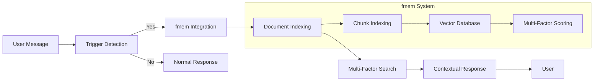
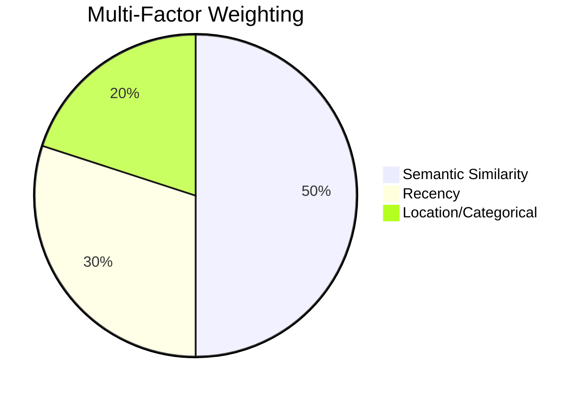
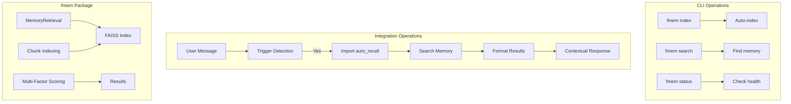

# fmem 🧠

**Contextual Memory for Natural Conversations**

Version: 3.0.0  
Status: Production Ready ✅  
License: MIT

---

## Overview

fmem is a privacy-first memory system that makes AI conversations feel natural and continuous. It remembers the precise context you need — not entire documents, not isolated keywords, but the *meaningful chunks* that matter.

> 🧠 **Memory that understands structure, not just text.**

**Core Innovation:** Chunk-level semantic indexing splits documents by structure (`##` headings) rather than arbitrary token boundaries. This delivers:
- **Precise retrieval** — Gets the relevant section, not the whole file
- **~57% token reduction** — Less noise, more signal in context windows
- **Natural conversation flow** — References that feel contextual, not robotic

**How It Works:**



**Multi-Factor Ranking:** Beyond simple similarity, fmem scores results by:
- **Semantic (50%):** FAISS vector similarity
- **Recency (30%):** Time-based decay based on file modification time  
- **Location/Categorical (20%):** Directory importance (docs: 1.5×, projects: 1.3×, chats: 0.8×)



**See Examples:** For detailed workflows and real-world usage, see [docs/EXAMPLES.md](./docs/EXAMPLES.md)

---

## Project Structure

```
projects/fmem/
├── src/                    # Core source code
├── docs/                   # Documentation
├── tests/                  # Test suite
├── examples/               # Usage examples
├── config/                 # Configuration templates
├── mcp-wrapper/           # MCP server implementation (future)
└── README.md              # This file
```

---

## Current Implementation

**Repository:** `github.com/LuisEduardoAvila/fmem`

### Architecture



### Components

| Component | Purpose | Location | Usage |
|-----------|---------|----------|-------|
| `MemoryRetrieval` | Core search class | `src/fmem/fmem.py` | Both CLI & Integration |
| `auto_recall()` | OpenClaw trigger handler | `src/fmem/fmem_integration.py` | Integration import: `from fmem import auto_recall` |
| `cli.py` | Command-line interface | `src/fmem/cli.py` | CLI commands: `fmem index`, `fmem search` |
| `ConfigManager` | Configuration handling | `src/fmem/fmem.py` | Package-level usage |

---

## Multi-Factor Ranking

**Formula:**
```
Score = (Semantic × 0.5) + (Recency × 0.3) + (Location × 0.2)
```

- **Semantic (50%):** FAISS vector similarity
- **Recency (30%):** Exponential decay based on file modification time
- **Location (20%):** Directory importance (docs: 1.5x, projects: 1.3x, chats: 0.8x)

---

## Integration Options

fmem supports three integration approaches:

### Option 1: AGENTS.md Integration ✅ CURRENT (Recommended)

**Status:** ✅ Implemented and Active

**How it works:**
- Agent reads AGENTS.md at session start
- Detects trigger words in user messages ("remember", "what about", etc.)
- Automatically recalls relevant context
- Injects naturally into conversation

**Example:**
```
User: "What were my fitness goals?"
Agent: (detects triggers → auto_recall() → responds with context)
```

**Pros:**
- ✅ Working immediately
- ✅ No code changes needed
- ✅ Agent decides when to recall
- ✅ Natural conversation flow

**Location:** See `AGENTS.md` - Memory Recall section

---

### Option B: Automatic Hook 🔄 PLANNED

**Status:** 🔄 Planned for Phase 2B

**How it will work:**
- Automatic `should_search()` on EVERY message
- Silent recall (injects context without mentioning)
- Token budget management
- Score threshold filtering

**Decision:** Evaluate after 2 weeks of Option 1 usage

---

### Option C: MCP Wrapper 📋 PLANNED

**Status:** 📋 Planned for Phase 3 (March 2026)

**How it will work:**
- TypeScript MCP Server + Python Bridge
- Universal client support (Claude Desktop, VS Code, etc.)
- Industry standard protocol
- Multi-client compatibility

**Documentation:** See `mcp-wrapper/RATIONALE.md` and `IMPLEMENTATION.md`

---

## Development Roadmap

### Phase 1: Core Stability ✅ (Complete)
- [x] FAISS integration
- [x] Chunk-level indexing
- [x] Multi-factor ranking
- [x] OpenClaw integration
- [x] Security hardening

### Phase 2: Enhanced Features (✅ ~60% Complete)
Status: Option 1 complete (AGENTS.md), Option B deferred for evaluation

**Completed:**
- [x] AGENTS.md memory integration (Option 1 - Active)
- [x] Security hardening (score: 8/10)
- [x] Documentation (INSTALLATION.md, API.md, ARCHITECTURE.md)

**Planned/Deferred:**
- [ ] Async support for non-blocking retrieval (4-6 hours)
- [🔄] Automatic Hook (Option B) - Dec 2026-03-01 after usage data
- [ ] Incremental re-indexing (file watching)

### Phase 3: MCP Wrapper (Future)
- [ ] MCP server implementation
- [ ] Multi-client support (OpenClaw, Claude Desktop, etc.)
- [ ] Standardized tool registration

### Phase 4: Advanced Features
- [ ] Hierarchical chunk indexing (heading levels)
- [ ] Graph-based chunk relationships
- [ ] Automatic summarization with caching
- [ ] Plugin architecture for custom formatters

---

## Known Technical Debt

1. **Monolithic Class:** `MemoryRetrieval` is 1,800+ lines - should be refactored into smaller classes
2. **Global State:** `CONFIG` singleton makes testing difficult
3. **No Async:** Synchronous only - blocks during embedding generation
4. **Cache TTL:** 1 hour fixed - should be configurable
5. **No Migration:** SQLite schema changes require manual migration

---

## Related Repositories

- **fmem:** Public fmem package (github.com/LuisEduardoAvila/fmem)

---

## Quick Links

- [Installation Guide](./docs/INSTALLATION.md)
- [API Documentation](./docs/API.md)
- [Architecture Overview](./docs/ARCHITECTURE.md)
- [Contributing](./CONTRIBUTING.md)

---

## CLI Usage

fmem provides a simple command-line interface for indexing and searching.

### Index documents

```bash
# Auto-index configured directories (from fmem.conf)
fmem index

# Index specific directory
fmem index /path/to/documents

# Index single file
fmem index /path/to/file.md
```

### Search

```bash
# Basic search
fmem search "your query"

# Search with top-k results
fmem search "your query" -k 5
```

### Check status

```bash
fmem status
```

---

## Configuration

Create `~/.openclaw/memory/fmem.conf`:

```ini
[settings]
# Storage location
data_dir = ~/.openclaw/memory
ollama_url = http://localhost:11434

# Directories to index (comma-separated)
additional_dirs = ~/Documents/notes, ~/projects

# Directories to exclude (important security feature)
exclude_dirs = .git, __pycache__, node_modules, .venv

# Specific files to index (alternative to additional_dirs for files)
index_files = ~/README.md, ~/todo.txt

# File extensions (narrows default: .md, .txt, .py, .json, .yaml, .yml, .csv)
extensions = .md, .txt, .py

# Index memory files
index_memory_md = true
index_daily_files = true
```

**Note:** Config `extensions` narrows code defaults. Code default includes: `.md, .txt, .py, .json, .yaml, .yml, .csv`.

---

**Last Updated:** 2026-02-16

---

## Project Status

| Phase | Status | Details |
|-------|--------|---------|
| Phase 1: Core Stability | ✅ Complete | FAISS, chunk indexing, ranking, security hardening |
| Phase 2: Enhanced Features | ✅ ~60% Complete | Option 1 done (AGENTS.md), async/incremental pending |

**Changes in this update:**
- ✅ Rewrote intro to emphasize natural conversation and precise memory retrieval
- ✅ Fixed repository references (DarthSpudFmem → fmem)
- ✅ Updated Quick Links to point to correct documentation paths
- ✅ Refined description of chunk-level indexing benefits
