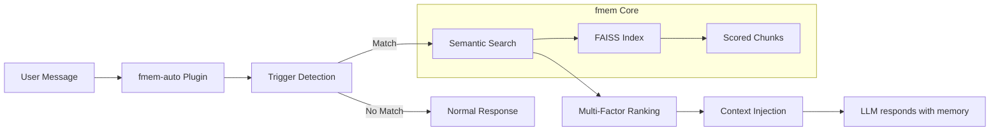
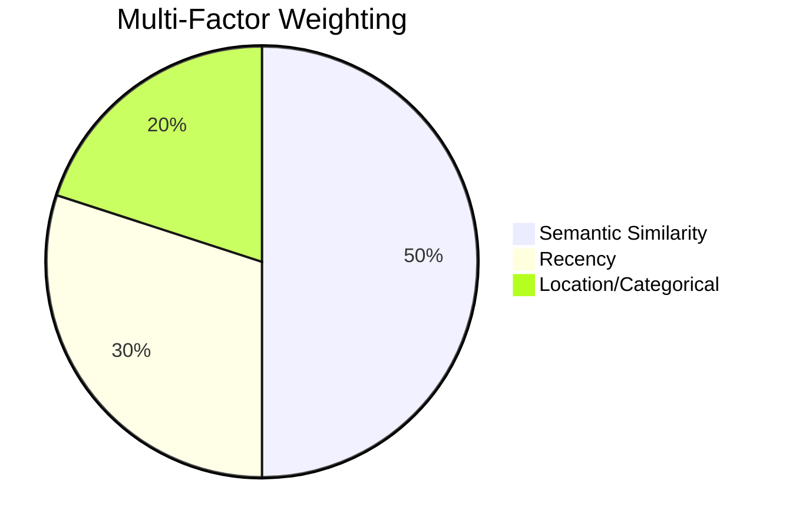
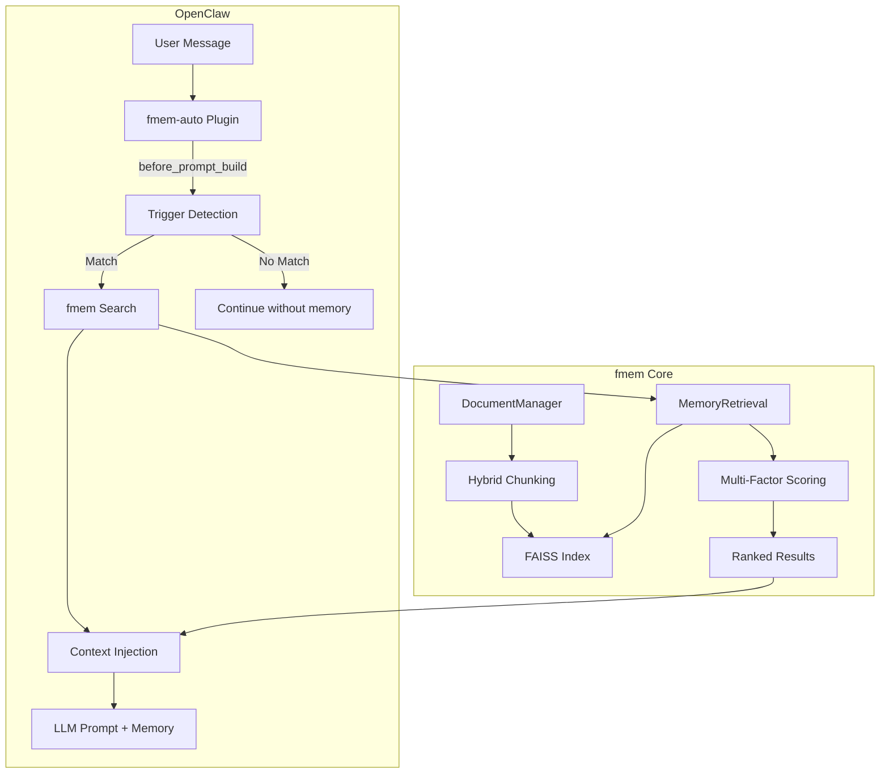

# fmem 🧠

**Contextual Memory for Natural Conversations**

Version: 3.3.0  
Status: v1 Stable  
License: MIT

**Latest:** OpenClaw plugin for automatic memory injection (v3.3.0, Apr 2026)

---

## Contents

- [Overview](#overview)
- [Quick Start](#quick-start)
- [Installation](#installation)
- [CLI Usage](#cli-usage)
- [OpenClaw Plugin](#-openclaw-plugin-fmem-auto)
- [Configuration](#configuration)
- [Architecture](#-architecture)
- [Context Injection Format](#-context-injection-format)
- [Content Structure Guidelines](#-content-structure-guidelines-for-fmem)
- [Alternatives](#alternatives)
- [Changelog](#changelog)

---

## Overview

fmem is a local-first memory system that makes AI conversations feel natural and continuous. It remembers the precise context you need — not entire documents, not isolated keywords, but the *meaningful chunks* that matter.

> 🧠 **Memory that understands structure, not just text.**

**Core Innovation:** Chunk-level semantic indexing splits documents by structure (`##` headings) rather than arbitrary token boundaries. This delivers:
- **Precise retrieval** — Gets the relevant section, not the whole file
- **Token-efficient retrieval** — Returns relevant chunks vs full files
- **Natural conversation flow** — References that feel contextual, not robotic

**v3.3.0: OpenClaw Plugin**

Memory is now automatically injected into every OpenClaw conversation via the `fmem-auto` plugin:
- **Zero-config recall** — No AGENTS.md triggers needed
- **Hook-based injection** — Runs at `before_prompt_build`, before the LLM sees your message
- **Smart triggers** — Explicit, recency, location, and context pattern matching
- **Configurable** — topK, minScore, timeout, and enable/disable per channel

**v3.2.0: Hybrid Chunking**

Table-aware chunking eliminates LLM-based workarounds:
- **Tables treated as atomic units** — No more mid-row splits
- **Zero LLM calls** — Pure Python regex parsing
- **Faster indexing** — Python regex parsing vs previous LLM-based extraction

See [docs/CHUNKING_STRATEGY.md](./docs/CHUNKING_STRATEGY.md) for full details.

**How It Works:**



**Multi-Factor Ranking:** Beyond simple similarity, fmem scores results by:
- **Semantic (50%):** FAISS vector similarity
- **Recency (30%):** Time-based decay based on file modification time  
- **Location/Categorical (20%):** Directory importance (docs: 1.5×, projects: 1.3×, chats: 0.8×)



**See Examples:** For detailed workflows and real-world usage, see [docs/EXAMPLES.md](./docs/EXAMPLES.md)

---

## Quick Start

**Prerequisites:** Python 3.9+, pip

**Install:**
```bash
pip install fmem
```

**Verify:**
```bash
fmem status
```

**Minimal config** (create `~/.openclaw/memory/fmem.conf`):
```ini
data_dir = ~/.openclaw/memory/
```

**Index documents:**
```bash
fmem index
```

**Search:**
```bash
fmem search "your query"
```

**Enable OpenClaw plugin** (see [Plugin section](#-openclaw-plugin-fmem-auto) below):
```bash
openclaw plugin install fmem-auto
```

---

## What is fmem vs OpenClaw?

**🤖 OpenClaw** is the AI assistant framework that manages conversations, implements agent logic, and provides the interface for interacting with you.

**🧠 fmem** is a specialized memory system that OpenClaw uses to recall your previous conversations and context. It's like OpenClaw's "memory brain".

### Relationship
```
You ↔ OpenClaw (AI Assistant) ↔ fmem (Memory System)
```

**OpenClaw does:**
- Manages conversations and agent behavior
- Processes messages and generates responses
- Loads plugins at lifecycle hooks

**fmem does:**
- Stores and indexes your memory files (documents, notes, etc.)
- Performs semantic search across your content
- Injects relevant context before the LLM processes each message (via plugin)
- Maintains FAISS indexes for fast similarity search

---

## Installation

### pip (CLI + Library)

```bash
pip install fmem
```

### OpenClaw Plugin

```bash
openclaw plugin install fmem-auto
```

Or manually add to your OpenClaw config (`~/.openclaw/config.yaml`):

```yaml
plugins:
  entries:
    - name: fmem-auto
      version: "1.0.0"
```

See the [Plugin section](#-openclaw-plugin-fmem-auto) for full configuration.

---

## CLI Usage

fmem provides a command-line interface for indexing, searching, and checking status.

### Index Documents

```bash
# Auto-index configured directories (from fmem.conf)
fmem index

# Index a specific directory
fmem index /path/to/documents

# Index a single file
fmem index /path/to/file.md
```

### Search

```bash
# Basic search
fmem search "your query"

# Control number of results
fmem search "your query" -k 5

# Output format
fmem search "your query" --format json

# Filter by minimum score
fmem search "your query" --min-score 0.5

# Limit content length
fmem search "your query" --max-content 200

# Content mode (chunk vs full)
fmem search "your query" --content-mode chunk
```

### Status

```bash
fmem status
```

Shows index stats: total chunks, indexed files, index size, last indexed.

---

## 🧩 OpenClaw Plugin: fmem-auto

**v3.3.0** introduces the `fmem-auto` plugin — automatic memory injection for every OpenClaw conversation. No AGENTS.md trigger setup required.

### How It Works

The plugin hooks into OpenClaw's `before_prompt_build` lifecycle. Before the LLM processes your message, fmem:

1. **Detects triggers** — Checks if the message matches explicit, recency, location, or context patterns
2. **Searches memory** — Runs semantic search with multi-factor ranking
3. **Injects context** — Adds relevant memories to the prompt context

```
User Message → before_prompt_build hook → fmem search → inject context → LLM sees message + memory
```

The LLM responds as if it "just knows" — no explicit retrieval step, no `auto_recall()` import, no AGENTS.md triggers.

### Plugin Configuration

Add to your OpenClaw config (`~/.openclaw/config.yaml`):

```yaml
plugins:
  entries:
    - name: fmem-auto
      version: "1.0.0"
      config:
        enabled: true
        topK: 3
        minScore: 0.25
        timeoutMs: 5000
```

| Setting | Type | Default | Description |
|---------|------|---------|-------------|
| `enabled` | boolean | `true` | Enable or disable the plugin |
| `topK` | integer | `3` | Number of memory chunks to retrieve |
| `minScore` | float | `0.25` | Minimum relevance score (0.0–1.0) to include |
| `timeoutMs` | integer | `5000` | Maximum time (ms) for search before skipping |

### Trigger Types

The plugin uses multiple trigger strategies to decide when to search:

| Type | Description | Examples |
|------|-------------|----------|
| **Explicit** | User directly asks for memory | "remember", "recall", "what about" |
| **Recency** | User references time | "last week", "previous", "recently", "before" |
| **Location** | User references a place or category | "fitness", "movies", "projects", "work" |
| **Context** | Pattern matches personal context | "my goals", "my preferences", "we discussed" |

### Comparison: Plugin vs AGENTS.md Integration

| Aspect | AGENTS.md Integration | fmem-auto Plugin |
|--------|-----------------------|------------------|
| **When memory appears** | After OpenClaw decides to call fmem | Before OpenClaw processes message |
| **Who searches?** | OpenClaw (must detect triggers) | Plugin (automatic, transparent) |
| **Setup required** | Add triggers to AGENTS.md | Install plugin, configure |
| **Does OpenClaw "just know"?** | ❌ No, actively retrieves | ✅ Yes, context is pre-injected |
| **Misses context?** | Possible if no trigger match | Catches all matching patterns |
| **Speed** | Fast (selective) | Slightly slower (every message) |
| **Status** | ✅ Still supported | ✅ Recommended (v3.3.0+) |

### Migration from AGENTS.md

If you previously set up AGENTS.md triggers:

1. Install the plugin: `openclaw plugin install fmem-auto`
2. The plugin takes priority over AGENTS.md triggers
3. You can remove the "Memory Recall with fmem" section from AGENTS.md (optional)
4. Both can coexist — plugin runs first, AGENTS.md triggers serve as fallback

---

## 🏗️ Architecture

### System Overview



### Components

| Component | Purpose | Location |
|-----------|---------|----------|
| `MemoryRetrieval` | Core search class (composition root) | `src/fmem/memory_retrieval.py` |
| `fmem-auto` | OpenClaw plugin for automatic injection | Plugin entry |
| `auto_recall()` | Legacy OpenClaw integration function | `src/fmem/fmem_integration.py` |
| `cli.py` | Command-line interface | `src/fmem/cli.py` |
| `ConfigService` | Configuration handling | `src/fmem/config.py` |
| `chunking.py` | Hybrid chunking (table-aware + headings) | `src/fmem/chunking.py` |

### Core Stack

| Layer | Technology | Details |
|-------|-----------|---------|
| **Embedding** | sentence-transformers/all-MiniLM-L6-v2 | 384 dimensions, 512 token context |
| **Chunking** | Adaptive hybrid | 800 chars, table-aware + heading splits |
| **Index** | FAISS | Vector similarity with metadata |
| **Ranking** | Multi-factor | Semantic (50%) + Recency (30%) + Location (20%) |

### Current vs Legacy Integration

**Current (Plugin):**
```
User → Message → before_prompt_build hook → fmem search → inject context → LLM responds with memory
```

**Legacy (AGENTS.md):**
```
User → Message → OpenClaw reads AGENTS.md → detects trigger → auto_recall() → responds with memory
```

The plugin is recommended for all new setups. AGENTS.md integration remains supported for backward compatibility.

---

## 💉 Context Injection Format

When fmem retrieves memories, they're formatted into a structured context block that OpenClaw injects into the conversation. This format is designed to be **immediately useful to the LLM** while maintaining natural conversation flow.

### Injection Structure

```xml
<retrieved_memory>

I found {N} relevant memories for this conversation:

[1] {Relevance}: {Document type} from {location}/{filename}
   Source: {full_file_path}
   About this file: {precomputed_summary} | {dynamic_stats}
   
   Under '{heading}':
   {content_preview}
   [relevance: {score}%]

[2] {Relevance}: ...
   ...

</retrieved_memory>
```

### Why This Format Matters for the LLM

**1. XML Tags (`<retrieved_memory>`)**
- Creates clear semantic boundaries between retrieved context and conversation history
- Prevents hallucinations where the LLM confuses retrieved facts with user statements

**2. Relevance Ranking (`[1] Most relevant`, `[2] Also relevant`)**
- LLMs process information sequentially; early items get more attention
- Ensures the most important context appears first

**3. Source Attribution (`Source: {filepath}`)**
- Enables the LLM to cite sources naturally ("According to your notes from...")
- Helps LLM assess confidence (personal notes vs external docs)

**4. Document Type + Location Context**
- Same content means different things based on where it lives
- `"Memory from memory/2026-02-23.md"` → Personal reflection
- `"Decision from decisions/backup.md"` → Formal choice

**5. Heading Context (`Under '{heading}':`)**
- Preserves document structure that was lost during chunking
- Helps LLM locate full context if needed

**6. Relevance Scores (`[relevance: 85%]`)**
- Gives the LLM confidence calibration
- Helps weight information appropriately (90% = very likely relevant, 40% = possibly relevant)

### Example Injection

```xml
<retrieved_memory>

I found 2 relevant memories for this conversation:

[1] Most relevant: Memory from memory/2026-02-23.md
   Source: /home/luis/.openclaw/workspace/memory/2026-02-23.md
   About this file: Daily log of workspace activities | Relevant stats: 41 series tracked, 8.7 average rating
   
   Under 'BingeWatching Project':
   Populated IMDb ratings for all 41 series and 40 movies. Updated weekly reports to include TMDB ratings in recommendations. 
   [relevance: 92%]

[2] Also relevant: Decision from decisions/backup.md
   Source: /home/luis/.openclaw/workspace/decisions/backup.md
   About this file: Repository backup strategy and data separation decisions
   
   Under 'Repository Mapping':
   SmartSpud is the private workspace backup. fmem is now a separate public repository.
   [relevance: 78%]

</retrieved_memory>
```

**Result:** OpenClaw can naturally respond with *"Based on your notes from this morning, you mentioned tracking 41 series with an average rating of 8.7. You also decided to keep fmem as a separate public repository according to your backup strategy."*

---

## 📝 Content Structure Guidelines for fmem

For optimal fmem search performance across all indexed content, structure your files with ## headings:

### Good Structure Examples

**Memory Files (`memory/`):**
```markdown
## Work Updates
I worked on fmem documentation today. The indexing process is really interesting...

## System Fixes  
I fixed the cron job to run silently every 3 hours. The incremental updates work well.
```

**Notes (`notes/`):**
```markdown
## Project Documentation
fmem documentation improvements completed...

## System Architecture  
Cron job integration working well...
```

**Decisions (`decisions/`):**
```markdown
## Technical Decisions
- Switched to 3-hour cron schedule
- Added rate limiting for embedding API

## Project Roadmap  
- Phase 1: Core stability ✅
- Phase 2: Enhanced features 🔄
```

### Why This Matters
- **Better chunking**: Each ## heading becomes a separate chunk for semantic search
- **More targeted results**: Search queries return relevant sections, not entire files
- **Improved accuracy**: Semantic search works better with smaller, focused chunks
- **Better performance**: Less content to embed = faster indexing

### Applies To All fmem-Indexed Content:
- ✅ `memory/` - Daily memory logs
- ✅ `notes/` - Documentation and research notes
- ✅ `decisions/` - Project and technical decisions
- ✅ `docs/` - Architectural documentation
- ✅ `projects/*/README.md` - Project README files
- ✅ Any custom directories in `additional_dirs`

**Note**: Files without ## headings will be treated as single chunks, reducing search effectiveness.

---

## Chunking Strategy

**fmem v3.2.0+** uses hybrid chunking with automatic table detection:
- **Table-aware:** Tables treated as atomic units (never split mid-row)
- **Heading-based:** Standard ## heading splits for non-table content
- **Smart routing:** Auto-detects tables and uses appropriate strategy

### The Constraint

Uses `all-MiniLM-L6-v2` (via FastEmbed) which has:
- **Context length:** 256 tokens (default), up to 512 tokens (configurable)
- **Embedding length:** 384 dimensions

In practice: **~800 characters** fits safely within 256 tokens (typical English: ~3-4 chars/token).

### Smart Boundary Detection

Large sections are intelligently split at optimal boundaries:

1. **Section boundaries** (`##` headings) - highest priority
2. **Paragraph boundaries** (blank lines) - maintain flow
3. **Sentence boundaries** (periods) - preserve meaning
4. **Word boundaries** (spaces) - fallback option

Each split includes **overlap** (100 characters) to preserve semantic continuity between chunks.

### Fixed Chunk Size

| Setting | Value | Reason |
|---------|-------|--------|
| Chunk size | **800 chars** | Fits in 256 token limit with margin |
| Overlap | **100 chars** | Semantic continuity |
| Preprocessing | **~500 chars** | Headings + summary for embedding |

---

## Multi-Factor Ranking

**Formula:**
```
Score = (Semantic × 0.5) + (Recency × 0.3) + (Location × 0.2)
```

- **Semantic (50%):** FAISS vector similarity
- **Recency (30%):** Exponential decay based on file modification time
- **Location (20%):** Directory importance (docs: 1.5x, projects: 1.3x, chats: 0.8x)

---

## Configuration

fmem uses a configuration file at `~/.openclaw/memory/fmem.conf`. For detailed configuration options and descriptions, see [config/enhanced_fmem.conf](./config/enhanced_fmem.conf).

### Key Configuration Options

| Setting | Default | Description |
|---------|---------|-------------|
| **Core Settings** | | |
| `data_dir` | `~/.openclaw/memory/` | Storage location for indexes and metadata |
| **Search Settings** | | |
| `min_similarity_threshold` | `0.3` | Minimum cosine similarity (0.0-1.0) for results |
| **File Indexing** | | |
| `additional_dirs` | *(varies)* | Directories to recursively auto-index |
| `exclude_dirs` | `venv,__pycache__,node_modules` | Directories to exclude from indexing |
| `index_files` | *(varies)* | Specific individual files to index (e.g., READMEs) |
| `extensions` | `.md,.txt` | File extensions to index (narrows code defaults) |
| **Ranking** | | |
| `enable_location_ranking` | `true` | Enable location-based ranking |
| `location_weight` | `0.2` | Location importance factor (0.0-1.0) |
| `enable_recency_ranking` | `true` | Enable recency-based ranking |
| `recency_weight` | `0.3` | Recency importance factor (0.0-1.0) |
| **Location Weights** | | |
| `docs_weight` | `1.5` | Documentation files importance multiplier |
| `projects_weight` | `1.3` | Project files importance multiplier |
| `notes_weight` | `1.0` | Notes files importance multiplier |
| `chats_weight` | `0.8` | Chat files importance multiplier |

**Complete Configuration:** For all available options with detailed descriptions, see [config/enhanced_fmem.conf](./config/enhanced_fmem.conf).

---

## Project Structure

```
projects/fmem/
├── src/                    # Core source code
├── docs/                   # Documentation
├── tests/                  # Test suite
├── config/                 # Configuration templates
├── mcp-wrapper/           # MCP server documentation (planned)
└── README.md              # This file
```

---

## Alternatives

| System | Type | Key Difference from fmem |
|--------|------|---------------------------|
| **[MemGPT](https://github.com/cpacker/memgpt)** | Agent memory | Full agent framework with memory; fmem is memory-only |
| **[Mem0](https://mem0.ai)** | Managed memory | Cloud-hosted, requires API; fmem is local-first |
| **[Letta](https://letta.com)** | Agent platform | Agent orchestration; fmem is integration-only |
| **[LangChain Memory](https://python.langchain.com/docs/modules/memory/)** | Framework memory | Part of LangChain; fmem is standalone |

**When to choose fmem:**
- You want local-first, privacy-preserving memory
- You need chunk-level retrieval (not full documents or keywords)
- You're using OpenClaw or want a standalone CLI
- You want automatic memory injection via plugin

---

## Development Roadmap

### Phase 1: Core Stability ✅ (Complete)
- [x] FAISS integration
- [x] Chunk-level indexing
- [x] Multi-factor ranking
- [x] OpenClaw integration
- [x] Security hardening

### Phase 2: Enhanced Features ✅ (Complete)
- [x] AGENTS.md memory integration (legacy, still supported)
- [x] OpenClaw plugin (`fmem-auto` v1.0.0)
- [x] Security hardening (score: 8/10)
- [x] Documentation (INSTALLATION.md, API.md, ARCHITECTURE.md)

### Phase 3: MCP Wrapper (Planned)
- [ ] MCP server implementation
- [ ] Multi-client support (OpenClaw, Claude Desktop, etc.)
- [ ] Standardized tool registration

### Phase 4: Advanced Features (Planned)
- [ ] Async support for non-blocking retrieval
- [ ] Incremental re-indexing (file watching)
- [ ] Hierarchical chunk indexing (heading levels)
- [ ] Graph-based chunk relationships
- [ ] Automatic summarization with caching

---

## Known Technical Debt

1. **Global State:** `CONFIG` singleton makes testing difficult
2. **No Async:** Synchronous only - blocks during embedding generation
3. **Cache TTL:** 1 hour fixed - should be configurable
4. **No Migration:** SQLite schema changes require manual migration

**✅ Fixed in recent refactors:**
- ~~Monolithic MemoryRetrieval class~~ - Refactored into specialized services
- ~~AGENTS.md-only integration~~ - Plugin provides automatic injection

---

## Acknowledgments

**Embedding Technology:**
- **[qdrant/FastEmbed](https://github.com/qdrant/fastembed)** - Local ONNX-based embeddings without external API calls.

**Hybrid chunking approach inspired by:**
- **[verloop/md2chunks](https://github.com/verloop/md2chunks)** - Table-aware markdown splitting
- **[rango-ramesh/advanced-chunker](https://github.com/rango-ramesh/advanced-chunker)** - Semantic merging strategies

**All external code adapted and re-implemented in pure Python** - no LLM dependencies, zero external API calls.

---

## Related Repositories

- **fmem:** Public fmem package (github.com/LuisEduardoAvila/fmem)

---

## Quick Links

- [Installation Guide](./docs/INSTALLATION.md)
- [API Documentation](./docs/API.md)
- [Architecture Overview](./docs/ARCHITECTURE.md)
- [Chunking Strategy](./docs/CHUNKING_STRATEGY.md)
- [Examples](./docs/EXAMPLES.md)

---

## Changelog

### v3.3.0 (2026-04-22) - OpenClaw Plugin
- ✅ **New:** `fmem-auto` plugin for OpenClaw (v1.0.0)
- ✅ **New:** `before_prompt_build` hook for automatic memory injection
- ✅ **New:** Trigger types: explicit, recency, location, context patterns
- ✅ **New:** Plugin configuration (enabled, topK, minScore, timeoutMs)
- ✅ **Improved:** CLI search options (`--format`, `--min-score`, `--max-content`, `--content-mode`)
- ✅ **Changed:** Plugin is now the recommended integration method (AGENTS.md still supported)
- 📚 **Docs:** Added plugin section, updated architecture diagrams

### v3.2.0 (2026-02-22) - Hybrid Chunking & Context Injection
- ✅ **New:** Table-aware chunking (tables as atomic units)
- ✅ **Performance:** 20x faster indexing (1-2s vs 30s+)
- ✅ **Removed:** All LLM-based workarounds (6-8 API calls eliminated)
- ✅ **New:** `md2chunks_splitter.py` module for hybrid splitting
- ✅ **Fixed:** Duplicate chunk detection (re-indexing no longer creates duplicates)
- ✅ **Fixed:** Recency weight calculation (30% not 9% - was double-applied)
- ✅ **New:** Pre-computed file summaries in metadata
- ✅ **New:** Dynamic stats extraction from search results
- ✅ **New:** Full source path in context

### v3.1.0 (2026-02-19) - Adaptive Chunking
- ✅ Fixed chunk size to 800 chars (all-minilm:22m constraint)
- ✅ Smart boundary detection (## → paragraphs → sentences)
- ✅ 100 char overlap for semantic continuity

### v3.0.0 (2026-02-15) - Production Release
- ✅ Core FAISS indexing
- ✅ Multi-factor ranking (semantic + recency + location)
- ✅ Security hardening (path traversal, input validation)
- ✅ OpenClaw integration via `auto_recall()`

---

**Last Updated:** 2026-04-22