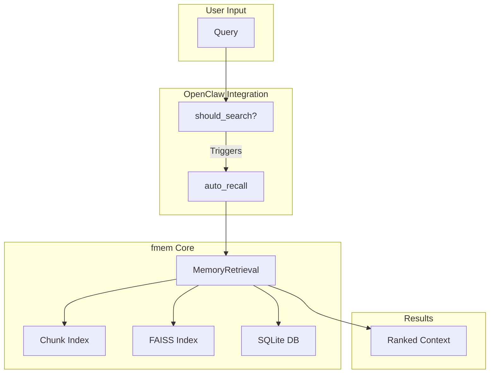

# fmem Architecture

## System Overview

```
┌─────────────────────────────────────────────────────────────────────────┐
│                              User Interface                              │
│  ┌──────────────┐  ┌──────────────┐  ┌──────────────┐  ┌──────────────┐ │
│  │  OpenClaw    │  │    CLI       │  │   Python API │  │  MCP Server │ │
│  │  Integration │  │  (fmem.cli)  │  │  (import)    │  │  (future)   │ │
│  └──────┬───────┘  └──────┬───────┘  └──────┬───────┘  └──────┬───────┘ │
└─────────┼──────────────────┼──────────────────┼──────────────────┼───────┘
          │                  │                  │                  │
          └──────────────────┴──────────────────┴──────────────────┘
                                     │
                                     ▼
┌─────────────────────────────────────────────────────────────────────────┐
│                            MemoryRetrieval Class                         │
│  ┌─────────────┐  ┌─────────────┐  ┌─────────────┐  ┌────────────────┐ │
│  │   Config    │  │   Chunking  │  │   Search    │  │  Persistence   │ │
│  │   Manager   │  │  (Markdown) │  │  (FAISS)    │  │ (SQLite/FAISS) │ │
│  └─────────────┘  └─────────────┘  └─────────────┘  └────────────────┘ │
└─────────────────────────────────────────────────────────────────────────┘
                                     │
                                     ▼
┌─────────────────────────────────────────────────────────────────────────┐
│                           Embedding Layer                                │
│  ┌────────────────────────────────────────────────────────────────────┐ │
│  │                         Ollama (Local)                              │ │
│  │              Model: nomic-embed-text (768 dimensions)              │ │
│  └────────────────────────────────────────────────────────────────────┘ │
└─────────────────────────────────────────────────────────────────────────┘
```

## Core Components

### 1. MemoryRetrieval Class

**Responsibility:** Central orchestrator for all memory operations

**Key Methods:**
- `add_document(filepath, content, chunk_by_sections)` - Index documents with chunking
- `search(query, top_k, chunk_mode)` - Semantic search with ranking
- `persist()` - Save index and metadata to disk
- `reset()` - Clear all data

**Architecture Pattern:** Facade - provides simplified interface to complex subsystem

### 2. Chunking System

**Responsibility:** Split documents into semantic sections

**Algorithm:**
1. Parse markdown by `##` headings
2. Create unique chunk IDs: `{filename}#{heading-slug}`
3. Extract keywords (top 5 words, 4+ chars)
4. Infer category from heading text
5. Count tokens (4 chars ≈ 1 token)

**Output:** `ChunkMetadata` objects with:
- `id`: Unique identifier
- `heading`: Section title
- `content`: Section text
- `keywords`: Extracted terms
- `category`: Inferred type
- `tokens`: Estimated count

### 3. Multi-Factor Ranking

**Formula:**
```
Final Score = (Semantic × 0.5) + (Recency × 0.3) + (Location × 0.2)
```

**Semantic Score:**
- FAISS inner product similarity
- Range: 0.0 to 1.0

**Recency Score:**
- Exponential decay: `exp(-age/30 days)`
- Never below 0.1 (min_recency_score)
- Modified time from filesystem

**Location Score:**
- Directory-based weights (docs: 1.5x, projects: 1.3x, chats: 0.8x)
- Normalized to 0.0-1.0 range
- Case-insensitive path matching

### 4. Storage Layer

**FAISS Index:**
- Type: IndexIDMap + IndexFlatIP (inner product)
- Dimension: 768 (nomic-embed-text)
- Persistence: Binary file `faiss_index.fai`

**SQLite Database:**
- Table: `chunks` with metadata
- Index on `parent_file` for fast lookup
- Schema version tracking

**JSON Metadata:**
- Document-level info (filepath, mtime, etc.)
- Separate from chunk metadata for efficiency

### 5. Embedding Cache

**Type:** LRU Cache with TTL
- Max size: 10,000 entries
- TTL: 1 hour
- Eviction: Least recently used

**Purpose:** Avoid redundant Ollama API calls for identical text

### 6. Configuration System

**Hierarchy (highest priority first):**
1. Environment variables (FMEM_DATA_DIR, etc.)
2. Config file (~/.openclaw/memory/fmem.conf)
3. Default values

**Key Settings:**
- `data_dir`: Storage location
- `ollama_url`: Embedding service endpoint
- `max_file_size`: 50MB limit
- `extensions`: Whitelist (.md, .txt, .py, etc.)

## Data Flow

### Indexing Flow

```
Document File
     │
     ▼
┌──────────────┐
│ Read Content │
│ (or provided)│
└──────┬───────┘
       │
       ▼
┌──────────────┐
│  Sanitize    │
│   Path       │
└──────┬───────┘
       │
       ▼
┌──────────────┐     ┌──────────────┐
│   Chunk by   │────▶│  Generate    │
│  Sections?   │     │  Embeddings  │
└──────────────┘     └──────┬───────┘
                            │
                            ▼
                     ┌──────────────┐
                     │  Store in    │
                     │ FAISS + DB   │
                     └──────────────┘
```

### Search Flow

```
Query String
     │
     ▼
┌──────────────┐
│  Validate    │
│  (length)    │
└──────┬───────┘
       │
       ▼
┌──────────────┐
│   Generate   │
│  Embedding   │
└──────┬───────┘
       │
       ▼
┌──────────────┐
│  FAISS       │
│  Search      │
│  (top_k*2)   │
└──────┬───────┘
       │
       ▼
┌──────────────┐
│   Enhance    │
│  (recency,   │
│  location)   │
└──────┬───────┘
       │
       ▼
┌──────────────┐
│   Filter &   │
│    Sort      │
└──────┬───────┘
       │
       ▼
┌──────────────┐
│   Return     │
│   Results    │
└──────────────┘
```

**Mermaid Visualization:**

```mermaid
flowchart LR
    A[User Query] --> B[Query Embedding]
    B --> C[FAISS Search]
    C --> D[Raw Results]
    D --> E[Multi-Factor Scoring]
    E --> F[Recency Boost]
    F --> G[Location Boost]
    G --> H[Final Ranking]
    H --> I[Top-k Results]
    
    style E fill:#f9f, stroke:#333
    note right of E: Semantic: 50%\nRecency: 30%\nLocation: 20%
```

## Security Architecture

### Defense in Depth

1. **Path Validation**
   - `sanitize_path()`: Rejects `..`, absolute paths
   - Whitelist of allowed base directories
   - Symbolic link validation

2. **Input Sanitization**
   - Query length limit: 1000 chars
   - File size limit: 50MB
   - Extension whitelist

3. **SQL Injection Prevention**
   - Parameterized queries only
   - No string interpolation in SQL

4. **Embedding Safety**
   - Content size validation before Ollama call
   - Timeout handling (30s)
   - Retry logic with backoff

### Trust Boundaries

- **Inside fmem:** Trusted (validated at entry points)
- **File System:** Untrusted (always validate paths)
- **Ollama API:** Semi-trusted (timeout, error handling)
- **User Input:** Untrusted (validate everything)

## Performance Characteristics

### Time Complexity

| Operation | Complexity | Notes |
|-----------|-----------|-------|
| Indexing | O(n) | n = chunks, linear embedding generation |
| Search | O(log n) | FAISS approximate search |
| Cache hit | O(1) | Hash lookup |
| Cache miss | O(n) | n = embedding dimension (768) |

### Space Complexity

| Component | Size | Scaling |
|-----------|------|---------|
| FAISS Index | 4KB per vector | Linear with documents |
| SQLite DB | ~1KB per chunk | Linear with chunks |
| Embedding Cache | Max 30MB | Bounded (10k entries) |
| Metadata JSON | ~100B per doc | Linear with documents |

### Bottlenecks

1. **Embedding Generation:** Ollama API call (~50-200ms per text)
2. **FAISS Search:** Index size > 100k vectors
3. **File I/O:** Large files (>10MB)
4. **SQLite:** Without proper indexing on `parent_file`

## Integration Patterns

### OpenClaw Integration

```
User Message
     │
     ▼
┌──────────────┐
│  should_     │
│  search()?   │
└──────┬───────┘
       │
       │ Yes
       ▼
┌──────────────┐
│  auto_recall │
│   (query)    │
└──────┬───────┘
       │
       ▼
┌──────────────┐
│  format_     │
│  results()   │
└──────┬───────┘
       │
       ▼
┌──────────────┐
│ <retrieved_  │
│ memory> tags │
└──────────────┘
```

### CLI Integration

Direct Python API access via `fmem.cli` module:
- Commands: `search`, `add`, `status`, `reset`
- Arguments: Parsed with argparse
- Output: Formatted text or JSON

### Future MCP Integration

```
MCP Client (any)
     │
     │ JSON-RPC
     ▼
┌──────────────┐
│ MCP Server   │
│ (TypeScript) │
└──────┬───────┘
       │
       │ Subprocess
       ▼
┌──────────────┐
│ Python Bridge │
└──────┬───────┘
       │
       ▼
┌──────────────┐
│   fmem Core   │
└──────────────┘
```

## Extension Points

### Custom Ranking

Override `MemoryRetrieval._enhance_search_results()`:
```python
class CustomMemoryRetrieval(MemoryRetrieval):
    def _enhance_search_results(self, results):
        # Custom ranking logic
        return super()._enhance_search_results(results)
```

### Custom Chunking

Override `chunk_markdown()` function:
```python
def custom_chunker(content: str) -> List[ChunkMetadata]:
    # Custom splitting logic
    pass

memory.add_document(filepath, chunk_by_sections=False)
# Then manually chunk with custom_chunker
```

### Custom Embedding

Replace Ollama with custom provider:
```python
class CustomMemoryRetrieval(MemoryRetrieval):
    def _get_embedding(self, text: str) -> Optional[np.ndarray]:
        # Custom embedding generation
        pass
```

## Known Limitations

1. **Single-node only:** No distributed support
2. **Local filesystem only:** No network storage
3. **Synchronous only:** No async/await support
4. **English-optimized:** Token estimation assumes English text
5. **Ollama-dependent:** Requires local Ollama instance

## Future Architecture (MCP Phase)

**Mermaid Visualization:**



**ASCII Visualization:**
┌─────────────────────────────────────────────────────────────────────────┐
│                         Universal Clients                               │
│  ┌──────────┐  ┌──────────┐  ┌──────────┐  ┌──────────┐  ┌──────────┐ │
│  │OpenClaw  │  │  Claude  │  │  VS Code │  │  Cursor  │  │   ...    │ │
│  └────┬─────┘  └────┬─────┘  └────┬─────┘  └────┬─────┘  └────┬─────┘ │
└───────┼─────────────┼─────────────┼─────────────┼─────────────┼───────┘
        │             │             │             │             │
        └─────────────┴─────────────┴─────────────┴─────────────┘
                                 │
                                 ▼
┌─────────────────────────────────────────────────────────────────────────┐
│                      MCP Protocol (JSON-RPC)                            │
└─────────────────────────────────────────────────────────────────────────┘
                                 │
                                 ▼
┌─────────────────────────────────────────────────────────────────────────┐
│                       fmem (Unchanged Core)                              │
└─────────────────────────────────────────────────────────────────────────┘
```

## References

- FAISS Documentation: https://faiss.ai/
- Ollama API: https://github.com/ollama/ollama/blob/main/docs/api.md
- MCP Specification: https://spec.modelcontextprotocol.io/
- nomic-embed-text: https://huggingface.co/nomic-ai/nomic-embed-text-v1

---

**Last Updated:** 2026-02-16  
**Version:** 3.0.0  
**Architecture Owner:** fmem Development Team
