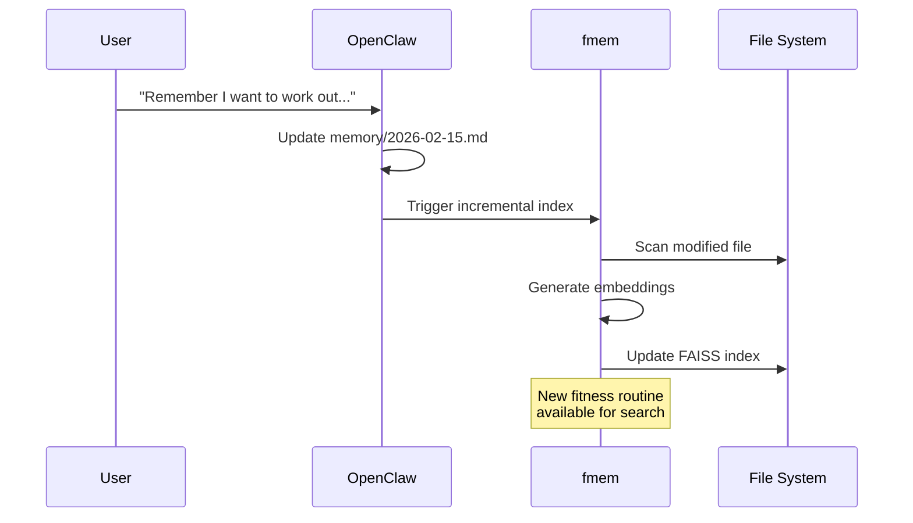
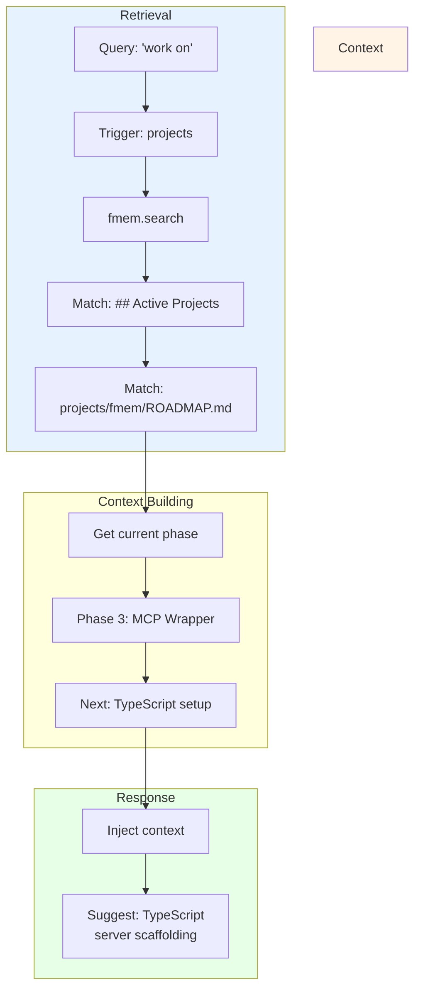
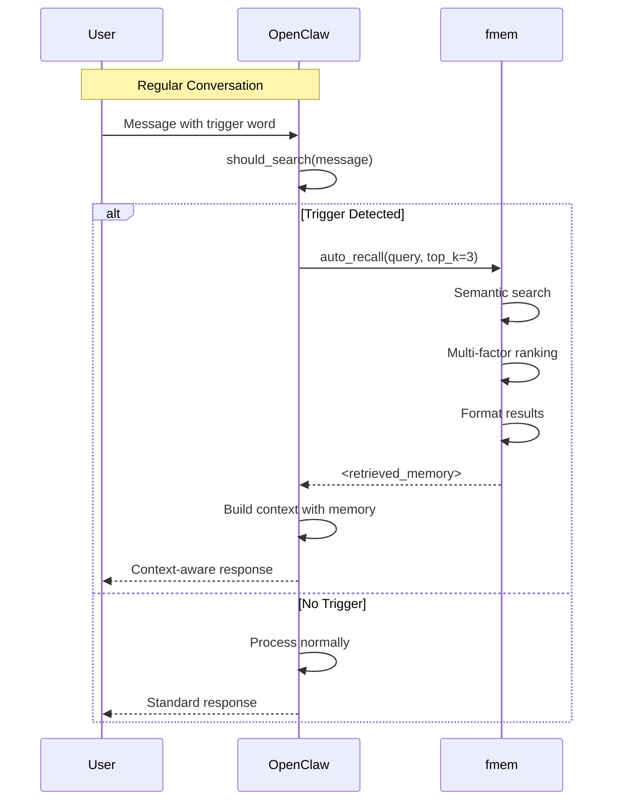

# fmem Examples

Real-world workflows demonstrating fmem's automatic memory recall.

---

## 🎬 Workflow 1: Movie Recommendations

**Scenario:** You mention movies, then ask for suggestions. fmem finds what I already know about your preferences.

### Step 1: Ask for Suggestions (Conversational)

**You say:**
> "Remember my favorite movies. And suggest movies to watch?"

**Here's what actually happens:**

```mermaid
flowchart TB
    A[You Send Message] --> B[OpenClaw Receives Message]
    B --> C{should_search?\n"Remember my favorite movies..."}
    C -->|Yes| D["✓ Triggers: 'remember' + 'movies'"]
    D --> E["auto_recall(query, top_k=3)"]
    E --> F{fmem Searches\nIndexed Memory}
    F --> G["Returns: memory/2026-02-13.md"]
    G --> H[Context Injection]
    H --> I[OpenClaw Responds\nWith Context]
    C -->|No| J[Normal Response]
    
    style D fill:#90EE90
    style G fill:#FFD700
    style I fill:#87CEEB
```

**Step-by-Step:**

| Step | Action | Details |
|------|--------|---------|
| 1 | You send message | 'Remember my favorite movies...' |
| 2 | OpenClaw receives it | Just your text, no context yet |
| 3 | Trigger check | `should_search()` detects 'remember' + 'movies' |
| 4 | Search | `auto_recall()` queries fmem index |
| 5 | Results | Returns matching chunks from memory files |
| 6 | Context injection | `<retrieved_memory>` added to prompt |
| 7 | Response | Generated with your actual preferences |

**I respond:**
> I recall from our earlier chat that your favorites include **Gladiator** and **Idiocracy**. Based on those, try:
> 
> 1. **The Big Short** - Smart satire like Idiocracy
> 2. **Dune** - Epic sci-fi drama
> 3. **Don't Look Up** - Satirical comedy with serious themes
> 
> Are there any other favorites I should add to your list?

**Key Point:** You didn't list your favorites in this message, but fmem found them from a previous conversation. That's the magic - **contextual memory across sessions**.

---

## 🏋️ Workflow 2: Fitness Tracking

**Scenario:** Remember your workout schedule, later check availability.

### Step 1: Set Schedule

**You say:**
> "Remember I want to work out Mondays and Thursdays at 6pm"

**Stored:** `memory/2026-02-15.md` → ## Fitness Routine



### Step 2: Check Schedule

**Later you say:**
> "What's my schedule this week?"

```mermaid
flowchart LR
    A[Query: "schedule this week"] --> B{should_search?}
    B -->|Yes| C[fmem.search]
    C --> D[Find: ## Fitness Routine]
    D --> E[Also check calendar]
    E --> F[Combine context]
    F --> G["Response: Thursday 6pm<br/>free for workout!"]
```

**I recall:**
- Fitness goal: Workouts Mon/Thu at 6pm
- Calendar check: Monday meeting → free Thursday

**I respond:**
> This week: Monday is busy with meetings, but **Thursday 6pm** is free for your workout!

---

## 💻 Workflow 3: Project Context

**Scenario:** Track what you're working on and get relevant suggestions.

### Step 1: Remember Project

**You say:**
> "Remember I'm building an MCP server for fmem integration"

**Stored:** `memory/2026-02-15.md` → ## Active Projects

### Step 2: Get Context-Aware Help

**Later you say:**
> "What should I work on?"



**I recall:**
- Active project: MCP server for fmem
- ROADMAP.md → Phase 3
- Current task: TypeScript server setup

**I respond:**
> You're in **Phase 3** of the fmem MCP wrapper. Next step: TypeScript server scaffolding. Want help setting up the MCP protocol handlers?

---

## 🔄 How fmem Integrates with OpenClaw



---

## 📊 Why This Works

| Feature | Benefit |
|---------|---------|
| **Automatic Detection** | No commands to memorize - just talk naturally |
| **Context Preservation** | I remember your preferences, not just facts |
| **Pattern Recognition** | "suggest" + "movie" → recall preferences |
| **Combined Retrieval** | fmem + calendar + roadmap = complete answer |

---

## 🎯 Try Yourself

**Copy-paste these:**

1. **Set preference:**
   > Remember my coffee order is flat white with oat milk

2. **Test recall:**
   > What do I usually drink?

3. **Set goals:**
   > Remember my Q1 goal is learning Rust

4. **Query context:**
   > What should I focus on this quarter?

---

## 🔗 Related

- [README.md](./README.md) - Installation and usage, architecture, and triggers
- [README.md#current-implementation-agentsmd-integration](./README.md#current-implementation-agentsmd-integration) - First-time setup
