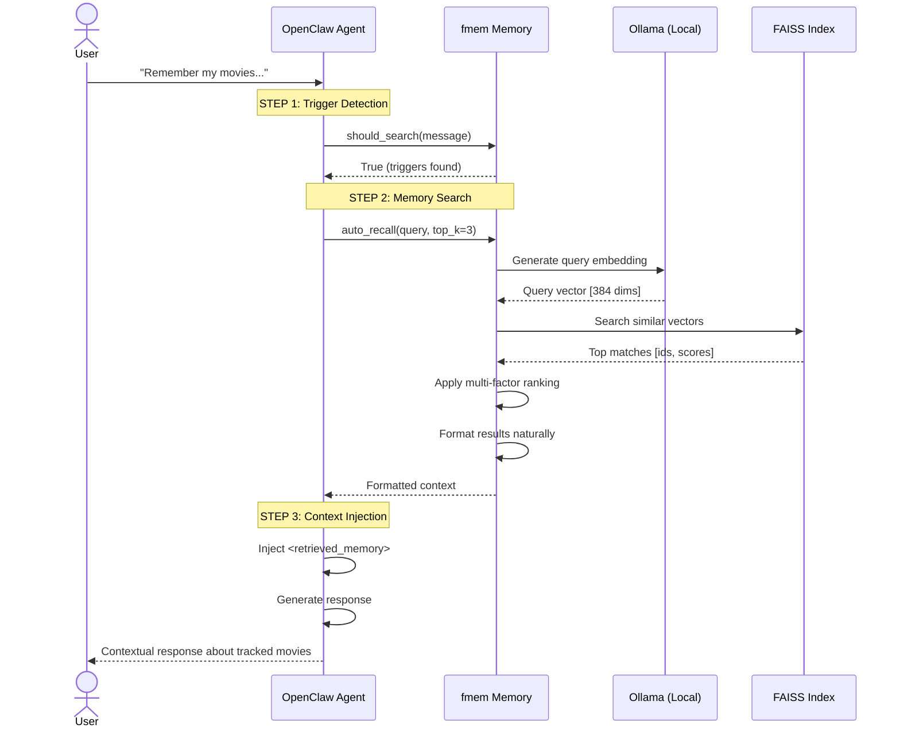
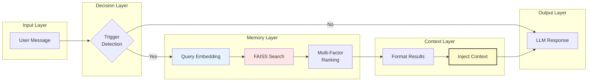
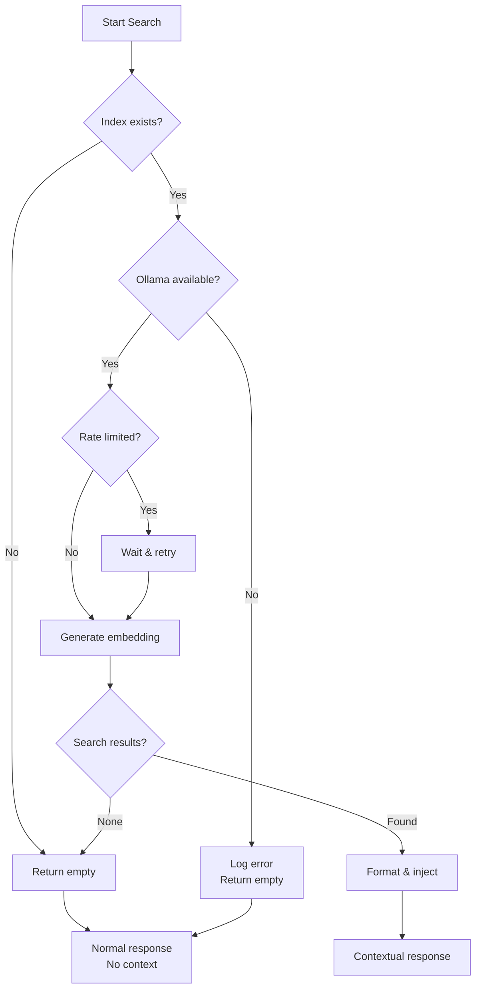

# fmem OpenClaw Integration Flow

Complete visual guide to how fmem integrates with OpenClaw for automatic memory recall.

---

## Overview

This document shows the step-by-step flow when a user message triggers memory search, from input to contextual response.

---

## Flow Diagram

```mermaid
flowchart TD
    START([User sends message]) --> STEP1
    
    STEP1[Step 1: OpenClaw receives message] --> STEP2
    STEP2[Step 2: should_search() triggers?] --> DECISION{Contains triggers?<br/>remember|recall|what about|etc}
    
    DECISION -->|No| SKIP[Skip memory search<br/>Return False]
    DECISION -->|Yes| STEP3[Step 3: auto_recall() executes]
    
    SKIP --> RESPONSE_NORMAL[Normal response<br/>No context added]
    
    STEP3 --> STEP4[Step 4: Generate embedding<br/>Query → Vector]
    STEP4 --> STEP5[Step 5: FAISS search<br/>Cosine similarity]
    STEP5 --> STEP6[Step 6: Apply multi-factor ranking<br/>Semantic + Recency + Location]
    STEP6 --> STEP7[Step 7: Filter & rank results]
    STEP7 --> DECISION2{Results found?}
    
    DECISION2 -->|No| RESPONSE_EMPTY[Empty context<br/>"No memories found"]
    DECISION2 -->|Yes| STEP8[Step 8: format_results()]
    
    STEP8 --> STEP9[Step 9: Context injection<br/>&lt;retrieved_memory&gt;]
    
    RESPONSE_EMPTY --> RESPONSE_CONTEXTUAL
    STEP9 --> STEP10[Step 10: OpenClaw generates<br/>contextual response]
    
    RESPONSE_NORMAL --> END_NORMAL([Normal conversation
    continues])
    RESPONSE_CONTEXTUAL --> END_CONTEXTUAL([Contextual
    response sent])
    
    STEP10 --> END_CONTEXTUAL
    
    style START fill:#90EE90
    style END_NORMAL fill:#FFB6C1
    style END_CONTEXTUAL fill:#90EE90
    style STEP9 fill:#FFD700,stroke:#333,stroke-width:2px
```

---

## Detailed Step Breakdown

### Step 1: User Input

```
┌─────────────────────────────────────────────┐
│ User sends message                          │
└─────────────────────────────────────────────┘
              │
              ▼
"Remember my movies. I'm thinking of adding
 some to the watch list"
```

### Step 2: Trigger Detection

```python
# OpenClaw calls:
should_search("Remember my movies...")

# Pattern matching:
- Contains: "remember" ✓
- Contains: "movies" ✓
- Result: True ✅
```

**Trigger Patterns:**
| Pattern | Example | Triggers? |
|---------|---------|-----------|
| `remember` | "Remember when..." | ✅ |
| `recall` | "Can you recall..." | ✅ |
| `what about` | "What about last week?" | ✅ |
| `my` + noun | "My watch list" | ✅ |
| Normal chat | "Hello" | ❌ |

### Step 3: Execute Search

```python
# OpenClaw calls:
results = auto_recall(
    message="Remember my movies...",
    top_k=3,
    chunk_mode="chunk"
)

# Behind the scenes:
1. Query embedding generated (all-minilm:22m)
2. FAISS.IndexFlatIP.search() - exact cosine similarity
3. Multi-factor scoring applied
4. Top results returned
```

### Step 4: Raw Results

```json
{
  "filepath": "/home/user/projects/BingeWatching/README.md",
  "score": 0.6973,
  "chunk_info": {
    "heading": "Current Tracked Movies",
    "content": "3 have new episodes this week..."
  },
  "semantic_score": 0.70,
  "recency_score": 0.85
}
```

### Step 5: Context Formatting

```python
# format_results() transforms:
Raw technical data → Natural language

# Before (raw):
<memory_chunk index="1" score="0.697">
  <content>3 have new episodes...</content>
</memory_chunk>

# After (formatted):
<retrieved_memory>
I found 1 relevant memory for this conversation:

[1] Most relevant: Movie/series tracking from README.md
   3 have new episodes this week. The Rookie has a 4-episode backlog...
   [relevance: 70%]
</retrieved_memory>
```

### Step 6: Context Injection

```
┌────────────────────────────────────────────────────┐
│ OpenClaw Prompt Assembly                             │
├────────────────────────────────────────────────────┤
│                                                      │
│ User: "Remember my movies..."                       │
│                                                      │
│ <retrieved_memory>                                  │
│ I found 1 relevant memory...                        │
│ [1] Movie/series tracking...                      │
│    3 have new episodes...                           │
│ </retrieved_memory>                                  │
│                                                      │
│ Generate contextual response...                       │
└────────────────────────────────────────────────────┘
```

### Step 7: Contextual Response

**With context, OpenClaw knows:**
- ✅ User has BingeWatching tracker
- ✅ 3 shows have new episodes
- ✅ The Rookie has 4-episode backlog
- ✅ Tracking 22 movies total

**Response:**
```
> I found your movie and series tracking info!
>
> From your BingeWatching tracker:
>   • 3 shows have new episodes this week
>   • The Rookie has a 4-episode backlog
>   • Currently tracking 22 movies (19 watched, 3 unwatched)
>
> What would you like to add to your watch list?
```

**Without context, OpenClaw would say:**
```
> I don't have any information about your movie tracking.
> Would you like to start a new watch list?
```

---

## Sequence Diagram



---

## Timing Breakdown

| Step | Operation | Typical Time |
|------|-----------|--------------|
| 1 | Trigger detection | <1ms |
| 2 | Query embedding | 50-200ms |
| 3 | FAISS search | 1-5ms |
| 4 | Result formatting | <1ms |
| 5 | Context injection | <1ms |
| 6 | Response generation | 500-2000ms |
| **Total** | **End-to-end** | **~600-2500ms** |

---

## Data Flow



---

## Real-World Example

### Input
```
User: "Remember my movies. I'm thinking of adding some to the watch list"
```

### Trigger Detection
```python
should_search("Remember my movies...")
# → True (matched: 'remember', 'movies')
```

### Search Results
```json
{
  "results": 1,
  "chunks": [{
    "filepath": "BingeWatching/README.md",
    "heading": "Current Tracked Movies",
    "content": "22 movies tracked (19 watched, 3 unwatched)...",
    "relevance": "70%"
  }]
}
```

### Context Injected
```markdown
<retrieved_memory>
I found 1 relevant memory for this conversation:

[1] Most relevant: Movie/series tracking from BingeWatching/README.md
   22 movies tracked (19 watched, 3 unwatched)...
   [relevance: 70%]
</retrieved_memory>
```

### Response Generated
```
I found your movie and series tracking info!

From your BingeWatching tracker:
  • 3 shows have new episodes this week
  • The Rookie has a 4-episode backlog
  • Currently tracking 22 movies (19 watched, 3 unwatched)

What would you like to add to your watch list?
```

---

## Configuration Points

### 1. Trigger Patterns

File: `src/fmem/fmem_integration.py`

```python
SEARCH_TRIGGERS = {
    'explicit': ['remember', 'recall', 'remind me'],
    'inquiry': ['what about', 'how about', 'what was'],
    'possessive': ['my', 'your'],
}
```

### 2. Search Parameters

| Setting | Default | Purpose |
|---------|---------|---------|
| `top_k` | 3 | Number of results to return |
| `min_similarity` | 0.3 | Minimum relevance threshold |
| `chunk_mode` | "chunk" | Return chunks vs documents |

### 3. Context Format

```python
format_results(
    results: list,
    max_preview: 200,  # Characters per result
)
```

---

## Error Handling Flow



---

## Key Files

| File | Purpose |
|------|---------|
| `src/fmem/fmem_integration.py` | OpenClaw integration functions |
| `src/fmem/fmem.py` | Core search & indexing |
| `docs/EXAMPLES.md` | Workflow examples |
| `README.md` | Quick start guide |

---

**Document Version:** 1.0  
**Last Updated:** 2026-02-22  
**fmem Version:** 3.2.0
