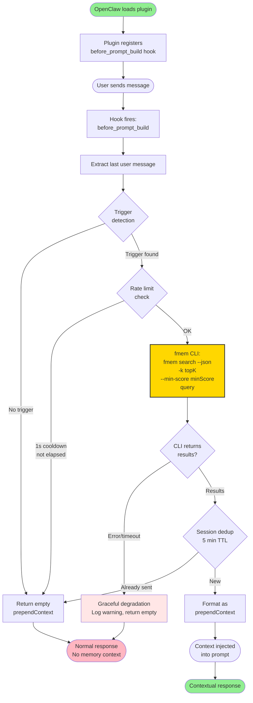
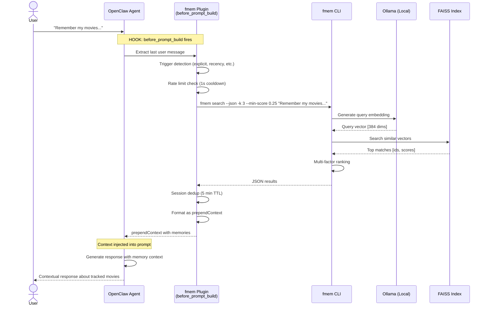
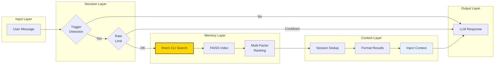
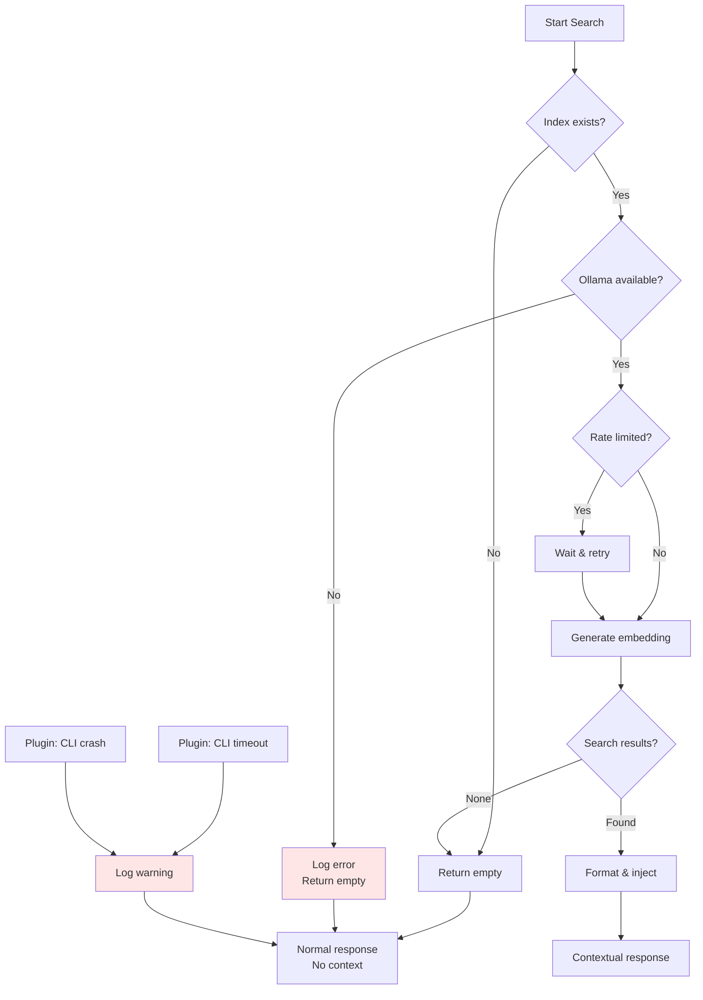

# fmem OpenClaw Integration Flow

Complete visual guide to how fmem integrates with OpenClaw for automatic memory recall.

---

## Overview

This document shows the step-by-step flow when a user message triggers memory search, from input to contextual response. fmem integrates with OpenClaw through two mechanisms:

1. **Plugin Integration** — automatic, hook-driven memory recall via the OpenClaw plugin system
2. **Direct API Integration** — programmatic calls from within agent logic

---

## OpenClaw Plugin Integration

### Architecture

fmem ships as an OpenClaw plugin that hooks into the prompt-building lifecycle. When a user message arrives, the plugin intercepts it before the LLM prompt is assembled, searches for relevant memories, and injects them as prepend context.

### Hook Flow



### Step-by-Step Detail

#### 1. Plugin Loading

OpenClaw loads the fmem plugin from its configured path during startup. The plugin registers a `before_prompt_build` hook, which fires every time OpenClaw prepares to build a prompt for the LLM.

#### 2. Message Extraction

When the hook fires, it extracts the last user message from the conversation. This is the query that fmem will search against.

#### 3. Trigger Detection

Not every message warrants a memory search. The plugin applies multiple trigger patterns:

| Trigger Type | Examples | Description |
|-------------|---------|-------------|
| **Explicit** | "remember", "recall", "remind me" | User explicitly requests memory |
| **Recency** | Recent context clues | Time-related references |
| **Location** | Place names, locations | Geographic references |
| **Context patterns** | "my X", "what about X" | Possessive/inquiry patterns |

If no trigger matches, the hook returns an empty `prependContext` — no search is performed.

#### 4. Rate Limiting

The plugin enforces a **1-second cooldown per session** to avoid redundant searches on rapid-fire messages. If a search was performed within the last second for the current session, the hook returns empty context.

#### 5. fmem CLI Search

The plugin invokes the fmem CLI directly:

```bash
fmem search --json -k <topK> --min-score <minScore> <query>
```

- `--json` — machine-readable output
- `-k <topK>` — number of results (default: 3)
- `--min-score <minScore>` — minimum relevance threshold (default: 0.25)
- `<query>` — the extracted user message

#### 6. Session-Scoped Deduplication

To avoid repeating the same memory in a conversation, results are deduplicated within a **5-minute TTL** per session. If a memory chunk was already injected in the last 5 minutes, it is suppressed.

#### 7. Context Formatting

Results are formatted as `prependContext`, which OpenClaw prepends to the prompt before sending it to the LLM. This gives the model access to relevant memories without modifying the conversation history.

#### 8. Graceful Degradation

If the fmem CLI fails (timeout, crash, index missing), the plugin logs a warning and returns empty context. The LLM proceeds normally — it simply won't have memory context. The user experience is never broken by a search failure.

### Configuration

The plugin is configured in OpenClaw's YAML config:

```yaml
plugins:
  entries:
    fmem-auto:
      enabled: true
      topK: 3
      minScore: 0.25
      timeoutMs: 5000
```

| Setting | Default | Description |
|---------|---------|-------------|
| `enabled` | `true` | Enable/disable the plugin |
| `topK` | `3` | Maximum number of memory results to return |
| `minScore` | `0.25` | Minimum similarity score (0–1) for a result to be included |
| `timeoutMs` | `5000` | Maximum time in milliseconds to wait for fmem CLI response |

### Plugin vs Direct API Comparison

| Aspect | Plugin Integration | Direct API |
|--------|-------------------|------------|
| **Activation** | Automatic (hook-driven) | Manual (agent calls function) |
| **Trigger** | Pattern-based detection | Agent decides when to search |
| **Rate limiting** | Built-in (1s cooldown) | Agent-controlled |
| **Deduplication** | Session-scoped (5 min TTL) | Not built-in |
| **Failure mode** | Graceful degradation | Agent must handle errors |
| **Configuration** | YAML config | Code parameters |
| **Use case** | Zero-config automatic recall | Custom agent workflows |

---

## Flow Diagram (Direct API)

```mermaid
flowchart TD
    START([User sends message]) --> STEP1
    
    STEP1[Step 1: OpenClaw receives message] --> STEP2
    STEP2[Step 2: should_search() triggers?] --> DECISION{Contains triggers?<br/>remember|recall|what about|etc}
    
    DECISION -->|No| SKIP[Skip memory search<br/>Return False]
    DECISION -->|Yes| STEP3[Step 3: auto_recall() executes]
    
    SKIP --> RESPONSE_NORMAL[Normal response<br/>No context added]
    
    STEP3 --> STEP4[Step 4: Generate embedding<br/>Query → Vector]
    STEP4 --> STEP5[Step 5: FAISS search<br/>Cosine similarity]
    STEP5 --> STEP6[Step 6: Apply multi-factor ranking<br/>Semantic + Recency + Location]
    STEP6 --> STEP7[Step 7: Filter & rank results]
    STEP7 --> DECISION2{Results found?}
    
    DECISION2 -->|No| RESPONSE_EMPTY[Empty context<br/>"No memories found"]
    DECISION2 -->|Yes| STEP8[Step 8: format_results()]
    
    STEP8 --> STEP9[Step 9: Context injection<br/>&lt;retrieved_memory&gt;]
    
    RESPONSE_EMPTY --> RESPONSE_CONTEXTUAL
    STEP9 --> STEP10[Step 10: OpenClaw generates<br/>contextual response]
    
    RESPONSE_NORMAL --> END_NORMAL([Normal conversation
    continues])
    RESPONSE_CONTEXTUAL --> END_CONTEXTUAL([Contextual
    response sent])
    
    STEP10 --> END_CONTEXTUAL
    
    style START fill:#90EE90
    style END_NORMAL fill:#FFB6C1
    style END_CONTEXTUAL fill:#90EE90
    style STEP9 fill:#FFD700,stroke:#333,stroke-width:2px
```

---

## Detailed Step Breakdown (Direct API)

### Step 1: User Input

```
┌─────────────────────────────────────────────┐
│ User sends message                          │
└─────────────────────────────────────────────┘
              │
              ▼
"Remember my movies. I'm thinking of adding
 some to the watch list"
```

### Step 2: Trigger Detection

```python
# OpenClaw calls:
should_search("Remember my movies...")

# Pattern matching:
- Contains: "remember" ✓
- Contains: "movies" ✓
- Result: True ✅
```

**Trigger Patterns:**
| Pattern | Example | Triggers? |
|---------|---------|-----------|
| `remember` | "Remember when..." | ✅ |
| `recall` | "Can you recall..." | ✅ |
| `what about` | "What about last week?" | ✅ |
| `my` + noun | "My watch list" | ✅ |
| Normal chat | "Hello" | ❌ |

### Step 3: Execute Search

```python
# OpenClaw calls:
results = auto_recall(
    message="Remember my movies...",
    top_k=3,
    chunk_mode="chunk"
)

# Behind the scenes:
1. Query embedding generated (all-minilm:22m)
2. FAISS.IndexFlatIP.search() - exact cosine similarity
3. Multi-factor scoring applied
4. Top results returned
```

### Step 4: Raw Results

```json
{
  "filepath": "/home/user/projects/BingeWatching/README.md",
  "score": 0.6973,
  "chunk_info": {
    "heading": "Current Tracked Movies",
    "content": "3 have new episodes this week..."
  },
  "semantic_score": 0.70,
  "recency_score": 0.85
}
```

### Step 5: Context Formatting

```python
# format_results() transforms:
Raw technical data → Natural language

# Before (raw):
<memory_chunk index="1" score="0.697">
  <content>3 have new episodes...</content>
</memory_chunk>

# After (formatted):
<retrieved_memory>
I found 1 relevant memory for this conversation:

[1] Most relevant: Movie/series tracking from README.md
   3 have new episodes this week. The Rookie has a 4-episode backlog...
   [relevance: 70%]
</retrieved_memory>
```

### Step 6: Context Injection

```
┌────────────────────────────────────────────────────┐
│ OpenClaw Prompt Assembly                             │
├────────────────────────────────────────────────────┤
│                                                      │
│ User: "Remember my movies..."                       │
│                                                      │
│ <retrieved_memory>                                  │
│ I found 1 relevant memory...                        │
│ [1] Movie/series tracking...                      │
│    3 have new episodes...                           │
│ </retrieved_memory>                                  │
│                                                      │
│ Generate contextual response...                       │
└────────────────────────────────────────────────────┘
```

### Step 7: Contextual Response

**With context, OpenClaw knows:**
- ✅ User has BingeWatching tracker
- ✅ 3 shows have new episodes
- ✅ The Rookie has a 4-episode backlog
- ✅ Tracking 22 movies total

**Response:**
```
> I found your movie and series tracking info!
>
> From your BingeWatching tracker:
>   • 3 shows have new episodes this week
>   • The Rookie has a 4-episode backlog
>   • Currently tracking 22 movies (19 watched, 3 unwatched)
>
> What would you like to add to your watch list?
```

**Without context, OpenClaw would say:**
```
> I don't have any information about your movie tracking.
> Would you like to start a new watch list?
```

---

## Sequence Diagram



---

## Timing Breakdown

| Step | Operation | Typical Time |
|------|-----------|--------------|
| 1 | Trigger detection | <1ms |
| 2 | Rate limit check | <1ms |
| 3 | Query embedding | 50-200ms |
| 4 | FAISS search | 1-5ms |
| 5 | Dedup check | <1ms |
| 6 | Result formatting | <1ms |
| 7 | Context injection | <1ms |
| 8 | Response generation | 500-2000ms |
| **Total** | **End-to-end** | **~600-2500ms** |

---

## Data Flow



---

## Real-World Example

### Input
```
User: "Remember my movies. I'm thinking of adding some to the watch list"
```

### Trigger Detection
```python
should_search("Remember my movies...")
# → True (matched: 'remember', 'movies')
```

### Search Results
```json
{
  "results": 1,
  "chunks": [{
    "filepath": "BingeWatching/README.md",
    "heading": "Current Tracked Movies",
    "content": "22 movies tracked (19 watched, 3 unwatched)...",
    "relevance": "70%"
  }]
}
```

### Context Injected
```markdown
<retrieved_memory>
I found 1 relevant memory for this conversation:

[1] Most relevant: Movie/series tracking from BingeWatching/README.md
   22 movies tracked (19 watched, 3 unwatched)...
   [relevance: 70%]
</retrieved_memory>
```

### Response Generated
```
I found your movie and series tracking info!

From your BingeWatching tracker:
  • 3 shows have new episodes this week
  • The Rookie has a 4-episode backlog
  • Currently tracking 22 movies (19 watched, 3 unwatched)

What would you like to add to your watch list?
```

---

## Configuration Points

### 1. Plugin Configuration (YAML)

```yaml
plugins:
  entries:
    fmem-auto:
      enabled: true
      topK: 3
      minScore: 0.25
      timeoutMs: 5000
```

| Setting | Default | Purpose |
|---------|---------|---------|
| `enabled` | `true` | Enable/disable automatic memory recall |
| `topK` | `3` | Number of results to return |
| `minScore` | `0.25` | Minimum relevance threshold |
| `timeoutMs` | `5000` | CLI call timeout in milliseconds |

### 2. Trigger Patterns

File: `src/fmem/fmem_integration.py`

```python
SEARCH_TRIGGERS = {
    'explicit': ['remember', 'recall', 'remind me'],
    'inquiry': ['what about', 'how about', 'what was'],
    'possessive': ['my', 'your'],
}
```

### 3. Search Parameters (Direct API)

| Setting | Default | Purpose |
|---------|---------|---------|
| `top_k` | 3 | Number of results to return |
| `min_similarity` | 0.3 | Minimum relevance threshold |
| `chunk_mode` | "chunk" | Return chunks vs documents |

### 4. Context Format

```python
format_results(
    results: list,
    max_preview: 200,  # Characters per result
)
```

---

## Error Handling Flow



### Graceful Degradation Guarantees

The plugin never blocks or breaks the conversation:

| Failure Mode | Plugin Behavior |
|-------------|----------------|
| fmem CLI timeout | Log warning, return empty prependContext |
| fmem CLI crash | Log warning, return empty prependContext |
| Index not found | Log warning, return empty prependContext |
| Ollama unavailable | Log warning, return empty prependContext |
| Rate limit hit | Return empty prependContext (no retry) |
| Dedup suppression | Return empty prependContext (already sent) |

In all cases, the LLM proceeds normally — it just won't have memory context.

---

## Key Files

| File | Purpose |
|------|---------|
| `src/fmem/fmem_integration.py` | OpenClaw integration functions |
| `src/fmem/fmem.py` | Core search & indexing |
| `docs/EXAMPLES.md` | Workflow examples |
| `README.md` | Quick start guide |

---

**Document Version:** 2.0  
**Last Updated:** 2026-04-22  
**fmem Version:** 3.2.0