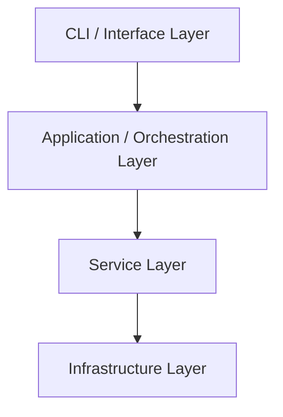

# Architecture Specification

> Generated by spec-gen v1.0.0 on 2026-02-28

## Purpose

This document describes the architectural patterns and structure of the system.

## Architecture Style

layered (strict dependency hierarchy with service layer encapsulating infrastructure; chosen to
isolate SQLite, file-system, and external-API concerns from the retrieval domain logic).

## Requirements

### Requirement: LayeredArchitecture

The system SHALL maintain separation between:
- CLI / Interface Layer (Entry points and user-facing commands that orchestrate high-level operations)
- Application / Orchestration Layer (Coordinates document lifecycle, batching, progress feedback, and cross-service workflows)
- Service Layer (Encapsulates core business capabilities: embedding generation, storage, and retrieval)
- Infrastructure Layer (External integrations and persistence adapters (SQLite, file system, embedding API))

#### Scenario: LayerSeparation
- **GIVEN** a request from the presentation layer
- **WHEN** business logic is needed
- **THEN** the presentation layer delegates to the business layer
- **AND** direct database access from presentation is prohibited

### Requirement: SecurityModel

The system SHALL implement security via: OS-level file permissions only; no auth layer—users rely on shell access control; input file paths are validated to prevent directory traversal before indexing.

#### Scenario: AuthenticatedAccess
- **GIVEN** an unauthenticated request
- **WHEN** accessing protected resources
- **THEN** access is denied

## System Diagram

## Layer Structure

### CLI / Interface Layer

**Purpose**: Entry points and user-facing commands that orchestrate high-level operations
**Location**: `save_memory_entry, get_memory_file_path, MemoryRetrieval public methods`

### Application / Orchestration Layer

**Purpose**: Coordinates document lifecycle, batching, progress feedback, and cross-service workflows
**Location**: `DocumentManager, MemoryRetrieval.search, add_document pipeline`

### Service Layer

**Purpose**: Encapsulates core business capabilities: embedding generation, storage, and retrieval
**Location**: `EmbeddingService, DatabaseService, MemoryRetrieval internal logic`

### Infrastructure Layer

**Purpose**: External integrations and persistence adapters (SQLite, file system, embedding API)
**Location**: `SQLite driver, file-system helpers, OpenAI/other embedding client wrapper`

## Data Flow

File or memory text → DocumentManager validation → chunking → EmbeddingService (with
cache/rate-limit) → vector + metadata → DatabaseService SQLite storage → user query →
EmbeddingService query vector → DatabaseService similarity search → ranked chunks returned to CLI.

## External Integrations

| System | Purpose |
|--------|---------|
| OpenAI (or compatible) embedding API | External integration |
| local SQLite database | External integration |
| local file-system workspace/memory/ | External integration |
